# git操作经验相关总结
## 目录
 - [git原理图](#git原理图)
 - [获取Git仓库](#获取Git仓库)
 - [配置git信息](#配置git信息)
   - [生成公钥](#生成公钥)
 - [基础操作](#基础操作)
   - [初始化仓库](#初始化仓库)
   - [跟踪新文件和暂存已修改文件](#跟踪新文件和暂存已修改文件)
   - [提交文件](#提交文件)
   - [远程提交](#远程提交)
 - [配置别名](#配置别名)
   - [查看最后一次提交记录](#查看最后一次提交记录)
 - [忽略文件](#忽略文件)
   - [忽略规则匹配语法](#忽略规则匹配语法)
   - [常用匹配示例](#常用匹配示例)
 - [查看提交历史](#查看提交历史)
 - [标签](#标签)
 - [删除文件](#删除文件)
 - [移动文件](#移动文件)
 - [查看已暂存和未暂存的修改](#查看已暂存和未暂存的修改)
 - [版本回退](#版本回退)
   - [revert](#revert)
 - [远程仓库的使用](#远程仓库的使用)
 - [分支的意义与管理](#分支的意义与管理)
   - [变基-rebase](#变基-rebase)
   - [变基的基本操作](#变基的基本操作)
 - [使用.gitkeep来追踪空的文件夹](#使用.gitkeep来追踪空的文件夹)

Git保存的不是文件的变化或者差异，而是一系列不同时刻的文件快照。

1. 配置并初始化一个仓库(repository);
2. 开始或停止跟踪(track)文件;
3. 暂存(stage);
4. 提交(commit)更改。

## git原理图


* **Workspace:** 工作区(本地电脑存放项目文件的地方)，执行`git add .`命令就把改动提交到了暂存区，执行`git pull`命令将远程仓库的数据拉到当前分支并合并，执行`git checkout [branch-name]`切换分支；
* **Index/Stage:** 暂存区，在使用git管理项目文件的时候，其本地的项目文件会多出一个`.git`的文件夹，将这个`.git`文件夹称之为版本库。其中`.git`文件夹中包含了两个部分，一个是暂存区（Index或者Stage），顾名思义就是暂时存放文件的地方，通常使用`git add`命令将工作区的文件添加到暂存区里。执行`git commit -m '说明'`命令就把改动提交到了仓库区（当前分支）；
* **Repository:** 仓库区（或本地仓库），`.git`文件夹里还包括git自动创建的master分支，并且将HEAD指针指向master分支。执行`git push origin master`提交到远程仓库，执行`git clone 地址`将克隆远程仓库到本地；
* **Remote:** 远程仓库，就是类似github，coding等网站所提供的仓库。

## 获取Git仓库
有两种获取Git项目仓库的方法：

1. 在现有项目或目录下导入所有文件到Git中;
2. 从一个服务器克隆一个现有的Git仓库(推荐)。

**[⬆ 返回顶部](#git操作经验相关总结)**
## 配置git信息
```
# 设置全局的用户名和邮箱
git config --global user.email "你的邮箱"
git config --global user.name "你的名字"

# 显示电脑的git配置
git config --list
```
### 生成公钥
公钥即`Ssh Key`。
```
ssh-keygen -t rsa
// 生成的公钥在用户家目录($HOME)下的.ssh目录下
cd $HOME/.ssh/
# 目录下的id_rsa.pub即公钥
```
```js
➜  ~ echo $HOME
/Users/liujie26
// Mac下默认是在家目录下
➜  ~ pwd
/Users/liujie26
➜  ~ cd .ssh
➜  .ssh ls
config      id_rsa      id_rsa.pub  known_hosts
```
添加Ssh Key到gitgub
```
github.com -> Settings -> SSH and GPG -> New SSH key
```
**[⬆ 返回顶部](#git操作经验相关总结)**
## 基础操作
### 初始化仓库
如果打算使用Git来对现有的项目进行管理，需要在项目目录中执行如下命令：
```
git init
# 该命令将创建一个名为.git的子目录，这个子目录含有你初始化的Git仓库中所有的必须文件，这些文件是Git仓库的骨干。这一命令仅仅是做了一个初始化的操作，项目中的文件并没有被跟踪。

git add .
# 该命令来实现对所有文件的跟踪，git add命令使用文件或目录的路径作为参数；如果参数是目录的路径，该命令将递归地跟踪该目录下的所有文件。git add命令是一个多功能命令，可以用它开始跟踪新文件，或者把已跟踪的文件放到暂存区，还能用于合并时把有冲突的文件标记为已解决状态等。

git commit -m "提交描述"
#该命令实现对文件修改的提交

git clone [url]
#克隆git仓库
git clone https://github.com/libgit2/libgit2
#该命令会在当前目录下创建一个名为"libgit2"的目录，并在这个目录下初始化一个.git文件夹，从远程仓库拉取下所有数据放入.git文件夹，然后从中读取最新版本的文件的拷贝。

git clone https://github.com/libgit2/libgit2 mylibgit
#自定义本地仓库名称为mylibgit
```
### 跟踪新文件和暂存已修改文件
`git add`命令用来跟踪新文件和暂存已修改文件。
```
# 添加指定文件到暂存区
git add [file1] [file2] ...

# 添加指定目录到暂存区，包括子目录
git add [dir]

# 添加当前目录的所有文件到暂存区
git add *

# 添加每个变化前，都会要求确认。对于同一个文件的多处变化，可以实现分次提交
git add -p
```
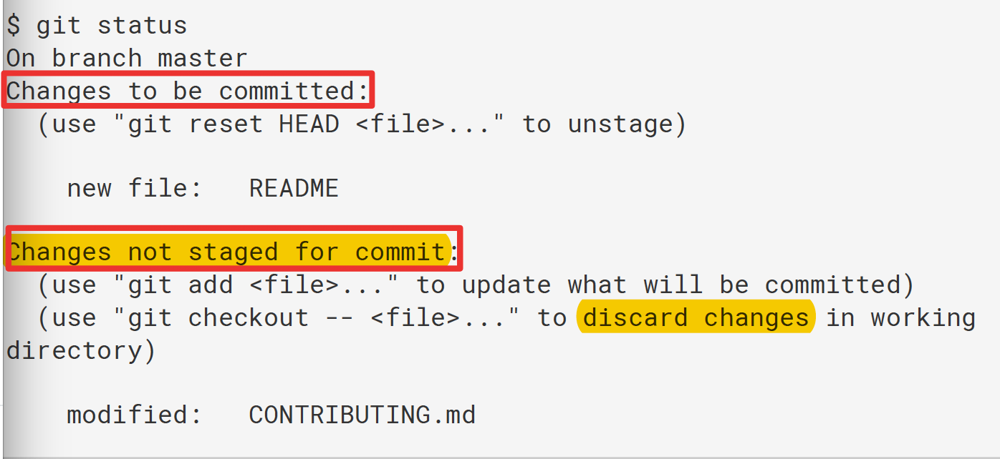

如上图所示：
只要在`Changes to be committed`这行下面的，就说明是已暂存状态。
出现在`Changes not staged for commit`这行下面，说明已跟踪文件的内容发生了变化，但还没有放到暂存区，要暂存这次更新，需要运行`git add`命令。
>来看一个更直观的图：

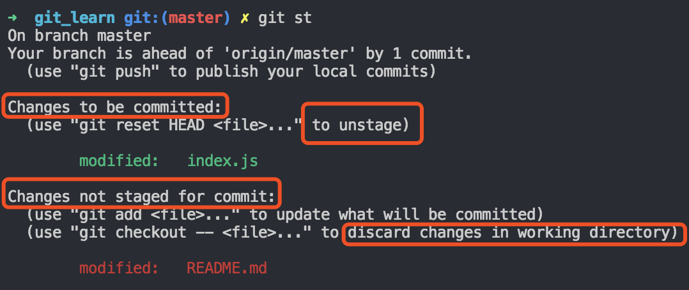
- 上图中绿色的文件是已经暂存的，即被`git add`了，可以使用`git reset HEAD index.js`恢复到没有被add的状态；
- 上图中红色的文件是未暂存的，仅仅是当前工作区的修改，可以使用`git checkout -- README.md`放弃当前工作区的修改；

在提交文件之前首先要添加文件到分支中，很多人只知道：`git add .`。如果有文件删除，会发现这些删除的文件并没有被附加进去，怎么？
```
#方式一
git add --all .
#方式二
git add -A .
```
* –all 参数，顾名思义，添加所有文件（change|delete|add）
* -A 参数，添加修改过和删除过的文件（change|delete）
* 不加 参数，添加修改过和添加的文件（change|add）

**[⬆ 返回顶部](#git操作经验相关总结)**
### 提交文件
```
# 提交暂存区到仓库区
git commit -m "comment"

# 提交暂存区的指定文件到仓库区
$ git commit [file1] [file2] ... -m "comment"

# 提交工作区自上次commit之后的变化，直接到仓库区
git commit -a

# 提交时显示所有diff信息
git commit -v

# 使用一次新的commit，替代上一次提交。如果代码没有任何新变化，则用来改写上一次commit的提交信息
git commit --amend -m [message]

# 重做上一次commit，并包括指定文件的新变化
git commit --amend [file1] [file2] ...

# 如果没有删除过文件，可以合并添加和提交文件为一步
git commit -am "add and commit"
```
### 远程提交
#### 首次推送
```
# 添加当前目录的所有文件变更到暂存区
git add .

# 提交暂存区到仓库区
git commit -m [message]

# 为远程Git更名为origin
git remote add origin git@github.com:abcd/tmp.git

# 推送此次修改，这是首次推送需要加上-u，之后推送就可以直接git push origin master,origin是远程Git名字，这个可以自己定义，不过一般是用origin，master是默认的分支，如果不在master分支提交需要写清楚分支名称
git push -u origin master
```
将代码更改提交到远程仓库上：
```
# 将 master 提交到 origin 上
git push origin master
```
这一步操作可能会出现很多的问题，比如：

a) origin为一个多人开发的库，别人在你提交之前已经向 origin 上提交过一次（或者多次），那么此时你的版本是落后于远程服务器版本的，你需要先拉去线上最新的代码：

```
# 拉去远程分支到master
git pull origin master
```
b) 执行 a) 之后，有可能也会有提醒：存在冲突，需要合并分支；
c) 如果你很自信，觉得线上的版本是存在问题，你这个版本没有问题，你可以强制提交你的代码：

```
git push -u origin master -f
```
这里需要特别注意，加了 `-f`参数，线上之前的修改就会被删掉，请谨慎使用！
**[⬆ 返回顶部](#git操作经验相关总结)**

## 配置别名
```js
// 以下命令配置st等同于status
git config --global alias.st status
git config --global alias.co checkout
git config --global alias.ci commit
git config --global alias.br branch
```
- `--global`参数是全局参数，这些简写命令对当前电脑的所有Git仓库都有效。
```js
// 配置后提交可以这样简写
git ci -m "msg"
```
我们知道，命令`git reset HEAD file`可以把暂存区的修改撤销掉(unstage)，重新放回工作区。既然这是一个`unstage`操作，就可以配置一个`unstage`别名：
```js
git config --global alias.unstage 'reset HEAD'
```
```：
git unstage demo.js
// 上述命令等同于下面的命令
git reset HEAD demo.js
```
### 查看最后一次提交记录
```js
git show --stat
```
不加`--stat`，查看最后一次提价详情
```js
git show
```
```js
git config --global alias.last 'show --stat'
// 这样一来，git last 等同于 git show --stat
```
```js
git config --global alias.lg "log --color --graph --pretty=format:'%Cred%h%Creset -%C(yellow)%d%Creset %s %Cgreen(%cr) %C(bold blue)<%an>%Creset' --abbrev-commit"
```
### 配置文件
#### git仓库配置文件
配置Git的时候，加上`--global`是针对当前用户起作用的，如果不加，那只针对当前的仓库起作用。那么配置文件在哪里呢？每个仓库的Git配置文件都放在`.git/config`文件中：
```js
cat .git/config
...
...
[alias]
    last = log -1
```
别名就在[alias]后面，要删除别名，直接把对应的行删掉即可。
#### 用户配置文件
当前用户的Git配置文件放在用户主目录下的一个隐藏文件`.gitconfig`中:
用户主目录：
```js
echo $HOME
// 输出用户主目录
/Users/用户名
```
```js
cat .gitconfig
[alias]
    co = checkout
    ci = commit
    br = branch
    st = status
[user]
    name = Your Name
    email = your@email.com
```
配置别名也可以直接修改这个文件，如果改错了，可以删掉文件重新通过命令配置。

**[⬆ 返回顶部](#git操作经验相关总结)**
## 忽略文件
一般我们总会有些文件无需纳入Git的管理，也不希望它们总出现在未跟踪文件列表。通常都是些自动生成的文件，比如日志文件，或者编译过程中创建的临时文件等。在这种情况下，我们可以创建一个名为`.gitignore`的文件，列出要忽略的文件模式。

### 忽略规则匹配语法
在 .gitignore 文件中，每一行的忽略规则的语法如下：

1. 空格不匹配任意文件，可作为分隔符，可用反斜杠转义
2. `#`开头的文件标识注释，可以使用反斜杠进行转义
3. ! 开头的模式标识否定，该文件将会再次被包含，如果排除了该文件的父级目录，则使用 ! 也不会再次被包含。可以使用反斜杠进行转义
4. / 结束的模式只匹配文件夹以及在该文件夹路径下的内容，但是不匹配该文件
5. / 开始的模式匹配项目跟目录
6. 如果一个模式不包含斜杠，则它匹配相对于当前 .gitignore 文件路径的内容，如果该模式不在 .gitignore 文件中，则相对于项目根目录
7. ** 匹配多级目录，可在开始，中间，结束
8. ? 通用匹配单个字符
9. [] 通用匹配单个字符列表

需要注意的`**`：

* 如果一个 pattern 以 ** 开头，如 **/foo，最后会匹配所有文件夹下的 foo 文件(夹)；
* 如果一个 pattern 以 /** 开头，如 abc/**，则表示匹配 abc 目录下的所有内容；
* 如果一个 pattern 中间包含 **，如 a/**/b，则会匹配 a/b、a/x/b、a/x/y/b 以及所有类似的内容。

**[⬆ 返回顶部](#git操作经验相关总结)**
### 常用匹配示例
```
# 忽略当前路径下的bin文件夹，bin文件夹下的所有内容都会被忽略，不忽略 bin 文件
bin/

# 忽略根目录下的bin文件
/bin

# 忽略 cat.c，不忽略 build/cat.c
/*.c

# 忽略 debug/io.obj，不忽略 debug/common/io.obj 和 tools/debug/io.obj
debug/*.obj

# 忽略/foo, a/foo, a/b/foo等
**/foo

# 忽略a/b, a/x/b, a/x/y/b等
a/**/b

# 不忽略 bin 目录下的 run.sh 文件
!/bin/run.sh

# 忽略所有 .log 文件
*.log

# 忽略当前路径的 config.php 文件
config.php

# 忽略所有以.o或.a结尾的文件
*.[oa]

# 忽略所有以波浪号结尾的文件
*~

# 忽略node_modules/目录下的所有文件
node_modules/

# 忽略所有以.json的文件
*.json

# 忽略foo目录下除了foo/bar/中的内容
foo/
!foo/bar/
```
### git操作中，add之后再加入gitignore
Git 操作中经常会出现这样的问题，当我们 git add 之后，突然想起来要添加一个 gitignore 文件，但是一些诸如 node_modules/, cache/ 等文件已经被 add 进去了，这些文件不会被 ignore 掉，怎么办？最直接的方式是：
```
# 这一步的操作相当于回到 git add 上一步
git rm -r --cached .
# 然后重新 add
git add --all .
# 重新提交
git commit -m 'update .gitignore'
```
**[⬆ 返回顶部](#git操作经验相关总结)**
## 标签
标签的作用主要是用来做版本回退的，关于版本回退，这也是Git的亮点之一，起到了后悔药的功能。
```
# 列出所有tag
git tag

# 新建一个tag在当前commit
git tag [tag]

# 新建一个tag在指定commit
git tag [tag] [commit]

# 删除本地tag
git tag -d [tag]

# 删除远程tag
git push origin :refs/tags/[tagName]

# 查看tag信息
git show [tag]

# 提交指定tag
git push [remote] [tag]

# 提交所有tag
git push [remote] --tags

# 新建一个分支，指向某个tag
git checkout -b [branch] [tag]
```
**[⬆ 返回顶部](#git操作经验相关总结)**
## 删除文件
要从Git中移除某个文件，就必须要从已跟踪文件清单中移除(确切地说，是从暂存区中移除)，然后提交。可以用`git rm`命令完成此项工作，并连带从工作目录中删除指定的文件，这样以后就不会出现在未跟踪文件清单中了。

* **删除文件跟踪并且删除文件系统中的文件file1**

```
# git rm命令后面可以列出文件或者目录的名字
# 删除文件file1，并将这次删除放入暂存区
git rm file1

# 提交刚才的删除动作，之后git不再管理该文件
git commit

# 此命令删除log/目录下扩展名为.log的所有文件
git rm log/\*.log

# 删除以~结尾的所有文件
git rm \*~
```
如果删除之前修改过并且已经放到暂存区域的话，则必须要用强制删除选项`-f`。

* **删除文件跟踪但不删除文件系统中的文件**

这种情况是我们想把文件从Git仓库中删除(即从暂存区中移除)，但仍然希望保留在当前工作目录中。换句话说，就是想让文件保留在磁盘，但是并不想让Git继续跟踪。

```
# 停止追踪指定文件，但该文件会保留在工作区
git rm --cached file1

# 提交刚才的删除动作，之后git不再管理该文件，但是文件系统中还是有file1
git commit
```
**[⬆ 返回顶部](#git操作经验相关总结)**
## 移动文件
移动文件其实就是重命名操作。
```
# 改名文件，并且将这个改名放入暂存区
git mv [file-original] [file-renamed]

# 将README.md文件重新命名为README.jsx
git mv README.md READ.jsx

# git mv相当于运行了下面三条命令
mv README.md READ
git rm README.md
git add README
```
**[⬆ 返回顶部](#git操作经验相关总结)**
## 查看已暂存和未暂存的修改
可以使用`git diff`命令。那么`git diff`到底比较的是哪个两个文件之间的差异呢?
- `git diff`：查看当前工作区(workspace)和暂存区(index)的差异；
- `git diff --cached`：查看暂存区(index)和本地仓库(local repositorty)的差别
- `git diff HEAD`：查看当前工作区(workspace)和本地仓库(local repository)的差别，`HEAD`指向的是本地仓库(`local repository`)中最新提交的版本。

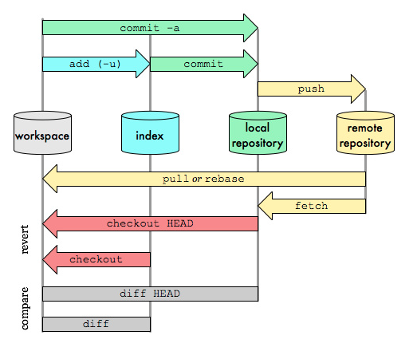
```
HEAD -> 表示上一次的commit版本
HEAD~n -> 表示第上n次的commit版本，这里的 n 是大于等于 1 的整数
```
了解了基本概念之后，我们来谈一谈犯错误之后如何撤销的问题。首先，我们要了解如何检查这 3 个步骤当中每一个步骤修改了什么，然后才好判断有没有修改成功。检查修改的二级命令都相同，都是`git diff`，只是参数有所不同。

### 已修改，未暂存
```
git diff
```
首先，对文件进行了修改，但是还没有做 `git add . `之前，我们如何检查有哪些修改：


这里可以看出在原文件中添加了`修改文件`四个字。

### 已暂存，未提交(执行了git add操作)
```
git diff --cached
```
现在我们先把修改放入暂存区。执行 `git add .` ，然后执行 `git diff`，发现没有任何结果。这说明 `git diff` 这个命令只检查我们的`工作区和暂存区`之间的差异，如果我们想看到`暂存区和本地仓库`之间的差异，就需要加一个参数`git diff --cached`。
### 已提交，未推送
```
git diff master origin/master
```
现在，我们把修改从`暂存区提交到本地仓库` ，再看一下差异。先执行`git commit`，然后再执行`git diff --cached`，没有差异，执行`git diff master origin/master`，可以看到差异。
在这里， `master`就是你的本地仓库 ，而`origin/master` 就是你的远程仓库 ，`master`是主分支，因为我们都在主分支上工作，所以这里两边都是`master` ，而 `origin` 就代表远程。
### 比较多次代码之间的差异
```
# 比较上一次和本次代码之间的差异
git diff HEAD~1 HEAD

# 比较前第三次与本次代码之间的差异
git diff HEAD~3 HEAD

# 前第n次代码
HEAD~n
```
### `git diff`和`git diff HEAD -- file`区别
- HEAD：指向的是版本库中的最新版本；
- file：指的是当前工作区中的指定文件
```js
// 本地仓库也就是版本库
// 以下命令查看当前工作区和本地仓库里面最新版本的区别
git diff HEAD -- file
```
### SHA
关于SHA，其实就是每次执行`git cimmit`之后生成的cimmitId。使用`git log`命令可以看到每次提交的SHA。要比较两次提交之间的差异，可以直接执行：

```
git diff SHA1 SHA2
# 其中 SHA1 和 SHA2 是两次提交（commit）的标识
```
### 提交更新
```
git commit -m "说明"
```

执行`git commit`命令后，可以看到，提交后git会告诉你当前在哪个分支(master)提交的，本次提交的完整SHA-1校验和是多少(463dc4f)，以及在本次提交中，有多少文件修改过，多少行添加和删改过。
### 跳过使用暂存区域
```
#给git commit加上-a选项，Git就会自动把所有已经跟踪过的文件暂存起来一并提交，从而跳过git add步骤。
git commit -am "说明"
```
**[⬆ 返回顶部](#git操作经验相关总结)**
## 版本回退
版本回退用于线上系统出现问题后恢复旧版本的操作，回退到的版本。
```
# 恢复暂存区的指定文件到工作区(针对没有add的情况)
# `git checkout`其实是用版本库里的版本替换当前工作区的版本，无论当前工作区是修改还是删除，都可以恢复
git checkout -- file

# 恢复某个commit的指定文件到暂存区和工作区
git checkout [commit] [file]

# 恢复暂存区的所有文件到工作区(针对没有add的情况)
git checkout .

# 回退到上一个版本，在Git中，用HEAD表示当前版本
git reset --hard HEAD^

# 重置暂存区的指定文件，与上一次commit保持一致，但工作区不变(从add状态变为非add状态)
git reset HEAD [file]

# 重置暂存区与工作区，与上一次commit保持一致
git reset --hard

# 重置当前分支的指针为指定commit，同时重置暂存区，但工作区不变
git reset [commit]

# 重置当前分支的HEAD为指定commit，同时重置暂存区和工作区，与指定commit一致
git reset --hard [commit]

# 重置当前HEAD为指定commit，但保持暂存区和工作区不变
git reset --keep [commit]

# 暂时将未提交的变化移除，稍后再移入
git stash
git stash pop
```
### revert
```js
# 新建一个commit，用来撤销指定commit。后者的所有变化都将被前者抵消，并且应用到当前分支
git revert [commit]
```
这一回退操作针对的是所有文件，如果后悔回退，继续`git pull`操作就可以了。

**[⬆ 返回顶部](#git操作经验相关总结)**
## 查看提交历史
`git log`提供的命令相当多，可以通过`git help log`查看，基本上可以满足我们日常查询需求。

* 查看日志
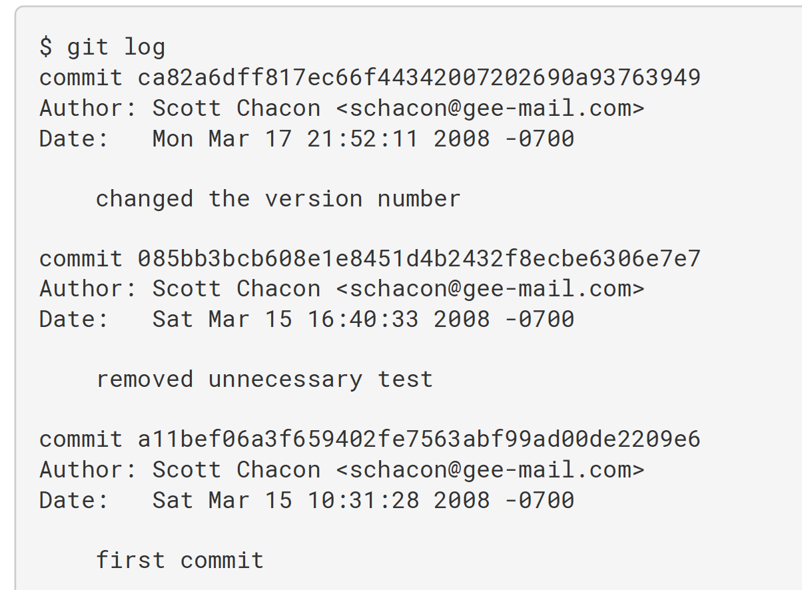

```
# 普通查看，显示当前分支的版本历史
git log

# 显示commit历史，以及每次commit发生变更的文件
git log --stat

# 搜索提交历史，根据关键词
git log -S [keyword]

# 显示某个commit之后的所有变动，每个commit占据一行
git log [tag] HEAD --pretty=format:%s

# 显示某个commit之后的所有变动，其"提交说明"必须符合搜索条件
git log [tag] HEAD --grep feature

# 显示某个文件的版本历史，包括文件改名
git log --follow [file]
git whatchanged [file]

# 显示指定文件相关的每一次diff
git log -p [file]

# 显示过去5次提交
git log -5 --pretty --oneline

# 显示所有提交过的用户，按提交次数排序
git shortlog -sn

# 显示指定文件是什么人在什么时间修改过
git blame [file]

# 简略形式(每次提交占一行)
git log --oneline

# 查看详细修改(只看最近两条)
git log -p -2

# 查看详细修改(只看5至8条)
git log -p --skip=5 -3

# 展示文件修改的量
git log --shortstat

# 简略展示，加分支情况
git log --pretty=format:"%h %s" --graph

# 查看单个文件被修改的情况
git log -p src/index.jsx

# 查看liujie修改过的.jsx文件
git log --author='liujie' \*.jsx

# 查看liujie在 2018 年 5 月内的所有动态：git log --author='liujie' --since='2018-05-01' --before='2018-06-01'

# 查看包含'Fix bug'的日志，一行展示
git log --grep='Fix bug' --oneline

# 查看某次修改的内容
git show 3a92f20(SHA)

# 查看 git-log 全貌命令，可以通过 alias 写到 .bashrc/.zshrc 中
alias gitlog="git log --all --graph --pretty=format:'%Cred%h%Creset -%C(yellow)%d%Creset %s %Cgreen(%cr) %C(bold blue)<%an>%Creset' --abbrev-commit --date=relative"
```
默认不用任何参数的话，`git log`会按提交时间列出所有的更新，最近的更新排在最上面。该命令会列出每个提交的`SHA-1`校验和、作者的名称和电子邮件地址、提交时间以及提交说明。

* 查看某一历史版本的提交内容，这里能看到版本的详细修改代码

```
# 显示某次提交的元数据和内容变化
git show 版本号

# 显示某次提交发生变化的文件
git show --name-only [commit]

# 显示某次提交时，某个文件的内容
git show [commit]:[filename]
```
* 对比不同版本

```
git diff 版本号1 版本号2

# 显示暂存区和工作区的差异
git diff

# 显示暂存区和上一个commit的差异
git diff --cached [file]

# 显示工作区与当前分支最新commit之间的差异
git diff HEAD

# 显示两次提交之间的差异
git diff [first-branch]...[second-branch]

# 显示今天你写了多少行代码
git diff --shortstat "@{0 day ago}"
```
**[⬆ 返回顶部](#git操作经验相关总结)**
## 远程仓库的使用
### 查看远程仓库
如果想查看你已经配置的远程仓库服务器，可以运行`git remote`命令。该命令会列出你指定的每一个远程服务器的简写。如果你已经克隆了自己的仓库，那么至少应该能看到`origin`-这是Git给你克隆的仓库服务器的默认名称。
```
git remote -v
#该命令会显示需要读写远程仓库使用的Git保存的简写与其对应的URL
```
### 添加远程仓库
```
git remote add <shortname> <url>
```
### 从远程仓库中抓取与拉取
```
#从远程仓库中获取数据，该命令会访问远程仓库，从中拉取所有你还没有的数据。执行完成后，你将会拥有那个远程仓库中所有分支的引用，可以随时合并或查看。
git fetch [remote-name]
# git fetch origin
```
如果使用`clone`命令克隆了一个仓库，命令会自动将其添加为远程仓库并默认以`origin`为简写。所以，`git fetch origin`会抓取克隆(或上一次抓取)后新推送的所有工作。必须注意`git fetch`命令会将数据拉取到你的本地仓库-它并不会自动合并或修改你当前的工作。当准备好时，必须手动将其合并入你的工作。

如果有一个分支设置为跟踪一个远程分支，可以使用`git pull`命令来自动的抓取，然后合并远程分支到当前分支。运行`git pull`命令通常会从最初克隆的服务器上抓取数据并自动尝试合并到当前所在的的分支。
### 推送到远程仓库
```
#remote-name 远程仓库名称
#branch-name 远程仓库对应的分支名
git push [remote-name] [branch-name]
```
### 查看远程仓库
```
# 查看某一个远程仓库的更多信息
git remote show [remote-name]
```
### 远程仓库的移除与重命名
```
#重命名
git remote rename 旧名称 新名称
#移除
git remote rm 远程仓库名称
#重名名或者移除之后，可以使用git remote命令查看操作的结果
```
**[⬆ 返回顶部](#git操作经验相关总结)**
## 分支的意义与管理
创建分支可以避免提交代码后对主分支的影响，同时也使我们有了相对独立的开发环境，分支在日常开发中具有很重要的意义。
```
# 新建一个分支，但依然停留在当前分支
git branch [branch-name]

# 新建一个分支，指向指定commit
git branch [branch] [commit]

# 切换到指定分支，并更新工作区
git checkout [branch-name]

# 切换到上一个分支
git checkout -

# 新建一个分支，与指定的远程分支建立追踪关系
git branch --track [branch] [remote-branch]

# 建立追踪关系，在现有分支与指定的远程分支之间
git branch --set-upstream [branch] [remote-branch]

# 合并指定分支到当前分支，如果有冲突需要手动合并冲突，然后add、commit再提交
git merge [branch]

# 选择一个commit，合并到当前分支
git cherry-pick [commit]

# 删除分支
git branch -d [branch-name]

# 强制删除分支
git branch -D [branch-name]

# 删除远程分支
git push origin --delete [branch-name]
git branch -dr [remote/branch]

# 在需要删除的分支前面加一个冒号就可以了，push上去之后，服务器上的分支自然就被删除了
git push origin :branch_name
```
>创建并切换到新建的分支：
```
git checkout -b 分支名
```
>查看本地分支，即查看本地创建了哪些分支：
```
git branch

# 列出所有远程分支
git branch -r
```
>查看本地+远程分支
```
git branch -va
# 列出所有本地分支和远程分支
git branch -a
```
* 切换到远程分支
```
git checkout remotes/origin/branch_name
// 新建并切换到该分支
git checkout -b branch_name
# -b的意思是base，就是以当前分支为base，新建一个分支

# 或者直接执行
git checkout -t origin/branch_name
```
### 变基-rebase
在Git中整合来自不同分支的修改主要有两种方法：`merge和rebase`。步骤：

```
# 1. 假设当前在dev分支上，将master分支上的更新同步到当前分支
git rebase master

# 2. 切换回master分支
git checkout master

# 3. 最后把dev分支的最新代码merge到master分支上
git merge dev
```
第三步是最重要的，git此时会自动`merge master分支和当前分支dev`。如果自动merge成功，就不需要再管了；如果自动merge失败，此时`git status`查看哪个文件merge失败，打开该文件，手动修改文件中冲突的地方，执行`git add .`命令去更新相应内容的索引，然后，不需要执行`git commit`命令，只要执行`git rebase --continue`，git会继续应用(apply)余下的补丁。

>需要注意的是：可以在任何时候，使用`git rebase --abort`命令来终止rebase的行动，并且当前分支会回到rebase开始前的状态。

**[⬆ 返回顶部](#git操作经验相关总结)**
### 变基的基本操作
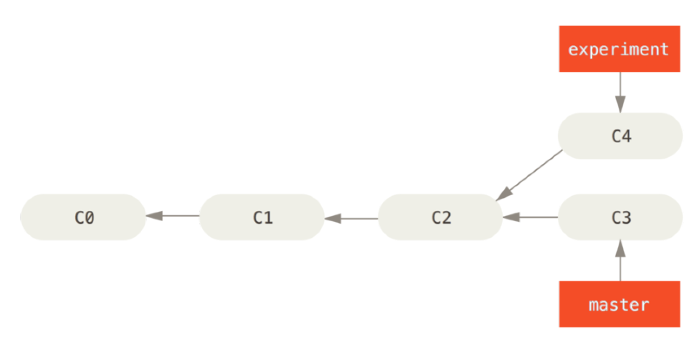

从上图可以看出，开发任务分叉到两个不同分支，又各自提交了更新。

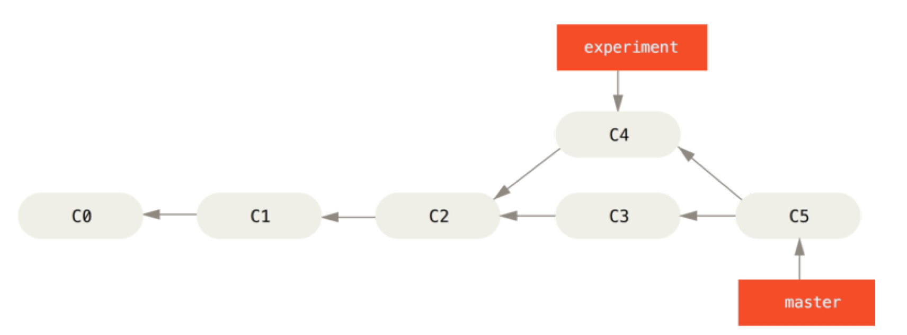

我们知道，整合分支最容易的方法是`git merge`命令，该命令会把两个分支的最新快照(C3和C4)以及两者最近的共同祖先(C2)进行三方合并，合并的结果是生成一个新的快照(C5)并提交。如上图所示：通过合并操作来整合分叉了的历史。


除了`git merge`之外，整合分支还有一种方法：我们可以提取在`C4`中引入的补丁和修改，然后在C3的基础上再应用一次。在Git中，这种操作就叫做变基。我们可以使用`rebase`命令将提交到某一分支上的所有修改都移至另一个分支上，就好像"重新播放"一样。

```
git checkout experiment
git rebase master
```
这一操作的原理是：首先找到这两个分支(即当前分支experiment、变基操作的目标基底分支master)的最近共同祖先C2，然后**对比当前分支`experiment`相对于该祖先的历次提交**，提取相应的修改并存为临时文件，然后将当前分支指向目标基底C3，最后将之前另存为临时文件的修改依序应用。如上图所示：将C4中的修改变基到C3上。

```
# 现在切换会master分支，进行一次快进合并
git checkout master
git merge experiment
```
这时候，`C4'`指向的快照就和上面使用`git merge`命令的例子中C5指向的快照一模一样了。这两种整合方法的最终结果没有任何区别，但是变基使得提交历史更加整洁。我们在查看一个经过变基础的分支的历史记录时会发现，尽管实际的开发工作是并行的，但是它们看上去就像是先后串行的一样，提交历史是一条直线没有分叉。


>**特别注意：** 无论是通过变基，还是通过三方合并，整合的最终结果所指向的快照始终是一样的，只不过提交历史不同罢了。变基是将一系列提交按照**原有次序**依次应用到另一分支上，而合并是把最终结果合在一起。
### rebase demo
在和远程分支同步后，对`demo.js`这个文件做了两次提交。用`git log`命令查看：
```js
git log --graph --pretty=oneline --abbrev-commit
```
>结果如下：

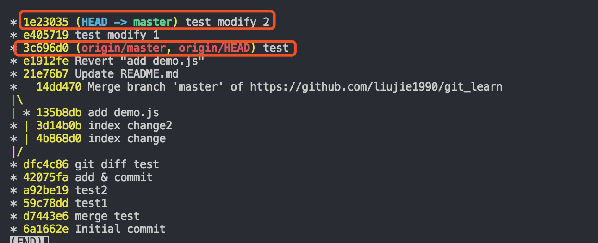

如上图所示：Git用(`HEAD -> master`)和(`origin/master`)分别标识出当前分支的`HEAD`和远程`origin`的位置分别是`1e23035 test modify 2`和`3c696d0 test`，本地分支比远程分支快了两个提交。

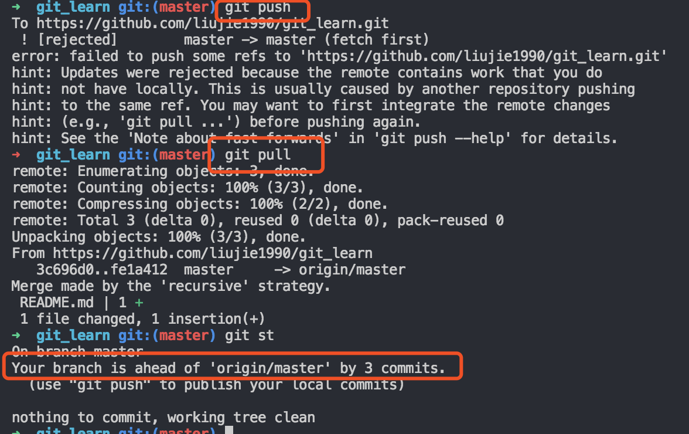
现在我们尝试推送本地分支，很不幸，失败了，这说明有人先于我们推送了远程分支，我们需要先`git pull`一下。再用`git status`看看状态，加上刚才合并的提交，现在我们本地分支比远程分支超前3个提交。

>用`git log`看看当前的提交历史：发现提交历史分叉了。

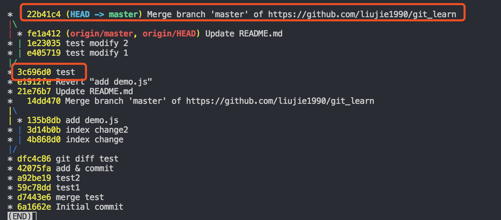

>使用`git rebase`命令解决提交历史分叉问题：
```js
➜  git_learn git:(master) git rebase
First, rewinding head to replay your work on top of it...
Applying: test modify 1
Applying: test modify 2
```
>重新使用`git log`命令查看：
```js
git log --graph --pretty=oneline --abbrev-commit
```
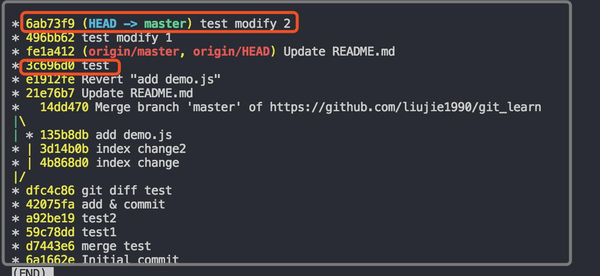

原本分叉的提交现在变成一条直线了！这种神奇的操作是怎么实现的？其实原理非常简单。我们注意观察，发现Git把我们本地的提交'挪动'了位置，放到了`fe1a412 (origin/master, origin/HEAD) Update README.md`之后，这样，整个提交历史就成了一条直线。rebase操作前后，最终的提交内容是一致的，但是，我们本地的commit修改内容已经变化了，它们的修改不再基于`3c696d0 test`，而是基于`fe1a412 (origin/master, origin/HEAD) Update README.md`，但最后的提交`6ab73f9 (HEAD -> master) test modify 2`内容是一致的。

>rebase操作的特点：把分叉的提交历史'整理'成一条直线，看上去更直观。缺点是：本地的分叉提交已经被修改过了(之前本地提交的commitId发生了变化，但是内容不变)。

最后，通过push操作把本地分支推送到远程：


>重新使用`git log`命令查看，远程分支的提交历史也是一条直线：

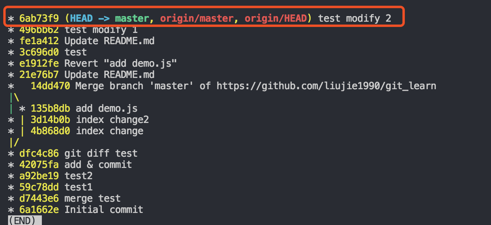


### git pull和git pull --rebase的区别使用
两者的区别可以用如下的等式来做解释：
```
git pull = git fetch + git merge
git pull --rebase = git fetch + git rebase
```
**[⬆ 返回顶部](#git操作经验相关总结)**
## git冲突文件编辑
冲突标记`<<<<<<< （7个<）与=======`之间的内容是我的修改，`=======与>>>>>>>`之间的内容是别人的修改。
解决冲突的关键：需要把代码合并好后重新走一遍代码提交流程就好了。

## 使用.gitkeep来追踪空的文件夹
Git会忽略空的文件夹。如果你想版本控制包括空文件夹，根据惯例会在空文件夹下放置`.gitkeep`文件。其实对文件名没有特定的要求。一旦一个空文件夹下有文件后，这个文件夹就会在版本控制范围内。

## git设置关闭自动换行
```
$ git config --global core.autocrlf false
```
为了保证文件的换行符是以安全的方法，避免windows与unix的换行符混用的情况，最好也加上这么一句。

```
$ git config --global core.safecrlf true
```

**[⬆ 返回顶部](#git操作经验相关总结)**
## 参考文章
1. [这些GIT经验够你用一年了](http://www.techug.com/post/some-git-tips.html)
2. [git rebase简介(基本篇)](http://blog.csdn.net/hudashi/article/details/7664631/)
3. [简单对比git pull和git pull --rebase的使用](https://www.cnblogs.com/kevingrace/p/5896706.html)
4. [Git，Github和Gitlab简介和基本使用](https://www.jianshu.com/p/8d497989f704)
5. [Git 常用操作总结](https://juejin.im/post/5a2cdfe26fb9a0452936b07f)
6. [用对 gitignore](https://www.barretlee.com/blog/2015/09/06/set-gitignore-after-add-file/)
7. [一篇文章，教你学会Git](https://cloud.tencent.com/developer/article/1159736)
8. [Git分支管理策略](https://cloud.tencent.com/developer/article/1096412)