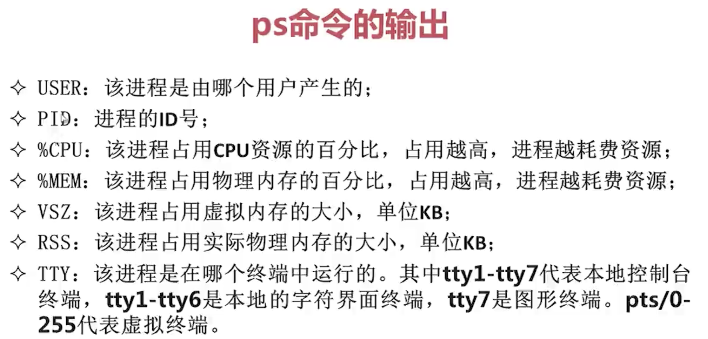
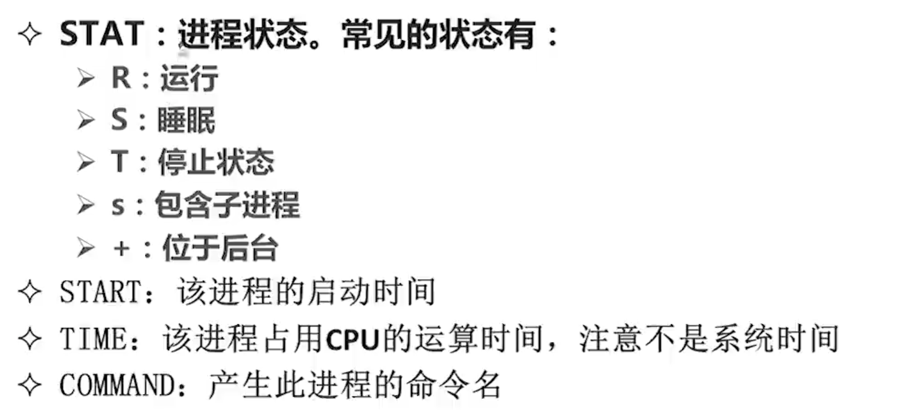
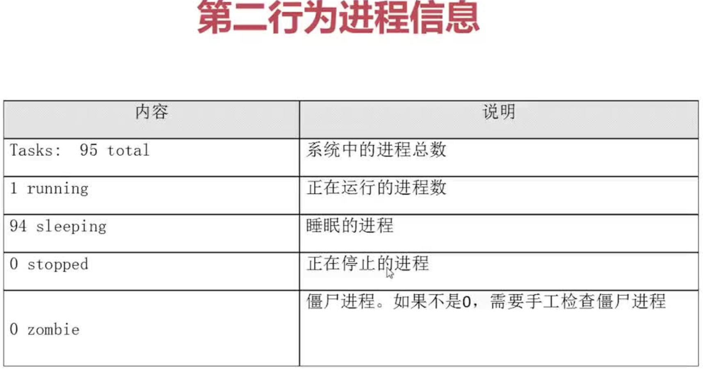
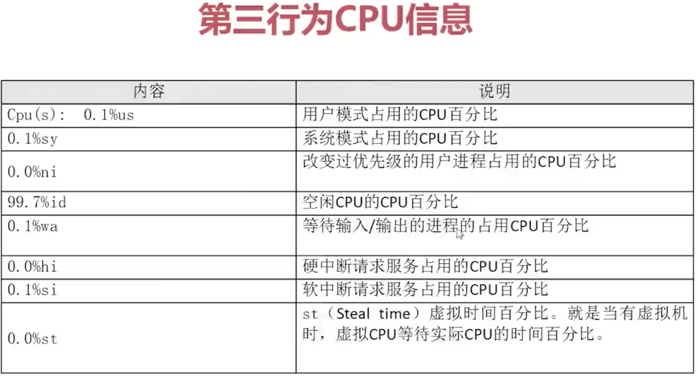
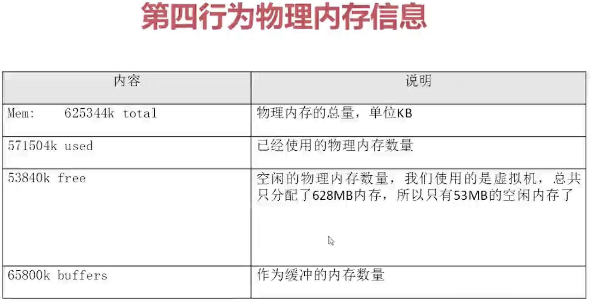
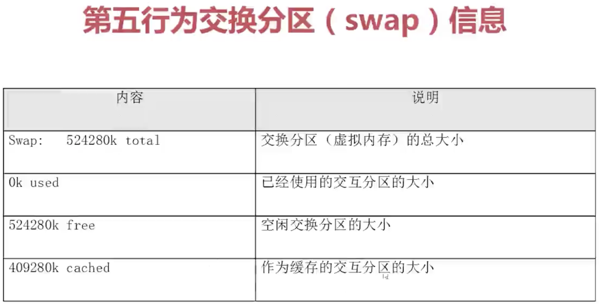
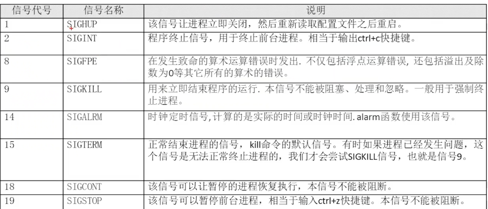
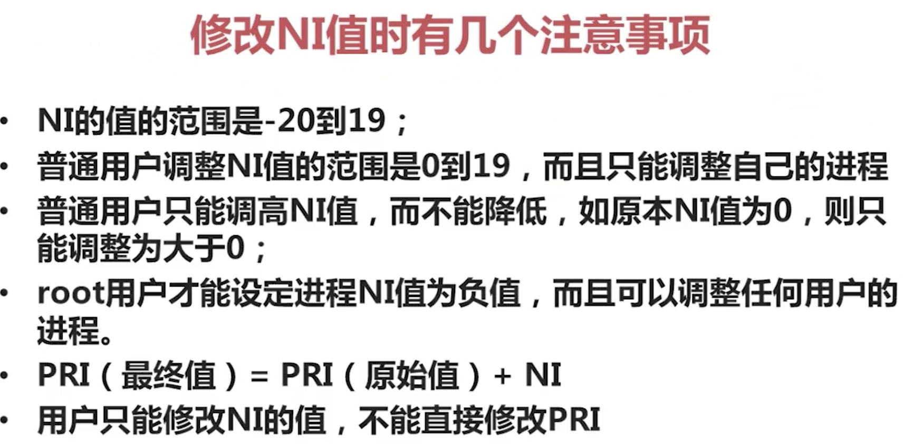

# Linux进程管理

## 目录
  - [进程简介](#进程简介)
  - [进程管理的作用](#进程管理的作用)
  - [进程的查看](#进程的查看)
    - [top命令](#top命令)
  - [杀死进程](#杀死进程)
    - [kill命令](#kill命令)
    - [killall命令](#killall命令)
    - [pkill命令](#pkill命令)
  - [修改进程的优先级](#修改进程的优先级)
    - [nice命令](#nice命令)
    - [renice命令](#renice命令)
  - [守护进程](#守护进程)
    - [nohup命令](#nohup命令)

## 进程简介
**进程(process)**顾名思义就是正在运行的程序(一个程序被加载到内存当中运作，那么在内存内的那个数据就被称为进程。进程是操作系统上非常重要的概念，所有系统上面跑的数据都会以进程的型态存在)。

在linux系统中，触发任何一个事件时，系统都会将它定义成为一个进程，并且给予这个进程一个ID，称为`PID`，同时依据启发这个进程的用户与相关属性关系，给予这个`PID`一组有效的权限设定。

进程是正在执行的一个程序或命令，每一个进程都是一个运行的实体，都有自己的地址空间，并占用一定的系统资源。
## 进程管理的作用
1. 判断服务器健康状态
2. 查看系统中所有进程
3. 杀死进程

**[⬆ 返回顶部](#Linux进程管理)**
## 进程的查看
```
#查看系统中所有进程，使用BSD操作系统格式
ps aux(常用)

#查看系统中所有进程，使用Linux标准命令格式
ps -le
```
>选项：
- a: 显示一个终端的所有进程，除了会话隐线
- u: 显示进程的归属用户及内存的使用情况
- -x: 显示没有控制终端的进程
- -l: 长格式显示。显示更加详细的信息
- -e: 显示所有进程，和-A作用一致




```
#查看进程树
pstree [选项]
#选项
-p: 显示进程的PID
-u: 显示进程的所属用户
```
### top命令
>mac中


>linux系统中

* PID: 进程的ID
* USER: 进程属主的名字
* PR: 进程的优先级
* NI: 进程的谦让度值
* VIRT: 进程占用的虚拟内存数量
* RES: 进程占用的物理内存总量
* SHR: 进程和其他进程共享的内存总量
* S: 进程状态(D代表可中断的休眠状态，R代表在运行状态，S代表休眠状态，T代表跟踪状态或停止状态，Z代表僵化状态)
* %CPU: 进程使用的CPU时间比例
* %MEM: 进程使用的内存占可用内存的比例
* TIME+: 自进程启动到目前为止的CPU时间总量
* COMMAND: 进程对应的命令行名称，也就是启动的程序名

默认情况下，`top`命令在启动时会按照`%CPU`值对进程排序。







**top命令结果解释：**（buffers缓冲用来加速数据写入，cached缓存用来加速数据读取）

* 第一行为任务队列信息：top - 系统当前时间，up 系统已运行的时长，users 当前登录的用户数量，load average(系统平均负载) 系统在最近1分钟，5分钟，15分钟的平均负载（与CPU核数相关，重要）值越大说明系统的负载越高；
* 第二行为进程信息：**tasks** 系统中的进程总数，**running** 正在运行的进程数，sleeping 睡眠的进程数，stopped 停止的进程数，zombie 僵尸进程（应该停止却没有停止的进程）僵化状态是指进程完成了，但父进程没有响应；
* 第三行为CPU信息：主要看第四个id(是空闲CPU的百分比)，一般不能低于20，否则会很卡；
* 第四行是物理内存信息：total 物理内存总量（单位KB），used 已使用的，free 空闲的，buffers 作为缓冲的；
* 第五行是交换分区的信息：主要看空闲交换分区的大小；
top -b -n 1 > /root/top.log 将执行的top命令结果输出到log日志文件中（top命令耗费资源比较大，应及时关闭）

**[⬆ 返回顶部](#Linux进程管理)**
## 杀死进程
**Linux进程信号:**

* 信号: 1   名称: HUP  描述: 挂起
* 信号: 2  名称: INT  描述: 中断
* 信号: 3   名称: QUIT  描述: 结束运行
* 信号: 9  名称: KILL  描述: 无条件终止
* 信号: 11   名称: SEGV  描述: 段错误
* 信号: 15   名称: TERM  描述: 尽可能终止
* 信号: 17   名称: STOP  描述: 无条件停止运行，但不终止
* 信号: 18   名称: TSTP  描述: 停止或暂停，但继续在后台运行
* 信号: 19   名称: CONT  描述: 在STOP或TSTP之后恢复执行

### kill命令
kill命令可通过进程ID给进程发信号。要发送进程信号，必须是进程的属主或登录为root用户。



```
#查看可用的进程信号
kill -l

#例子
#重启进程号2235对应的进程
kill -1 2235
#强制杀死进程号2236对应的进程(杀死单一进程)
kill -9 2236
#通过grep命令来过滤其他非httpd的进程
ps aux | grep httpd
```
### killall命令
```
killall [选项][信号] 进程名
#按照进程名杀死进程
#选项:
-i: 交互式，询问是否要杀死某个进程
-I: 忽略进程名的大小写
```
### pkill命令
```
pkill [选项][信号] 进程名
#按照进程名终止进程
选项:
-t 终端号:按照终端号踢出用户

#使用w命令查询本机已经登录的用户
w
#强制杀死从pts/1虚拟终端登录的进程
pkill -9 -t pts/1
```
**[⬆ 返回顶部](#Linux进程管理)**
## 修改进程的优先级
### 进程优先级简介
Linux操作系统是一个多用户、多任务的操作系统，Linux系统中通知运行着非常多的进程。但是CPU在同一个时钟周期内只能运算一个指令。进程优先级决定了每个进程处理的先后顺序。


### nice命令
nice命令不能修改已经存在进程的NI值。
```
#nice命令可以给新执行的命令直接赋予NI值，但是不能修改已经存在进程的NI值
nice [选项] 命令
#选项:
-n NI值: 给命令赋予NI值
#例如
nice -n -5 service httpd start
```
### renice命令
renice命令可以修改已经存在进程的NI值。
```
#renice命令可以修改已经存在进程的NI值
renice [优先级] PID
#例如
renice -10 2122
```
## 守护进程
"守护进程"（daemon）就是一直在后台运行的进程（daemon）。
### nohup命令
```
$ nohup node server.js &
```
nohup命令对server.js进程做了三件事。

1. 阻止SIGHUP信号发到这个进程。
2. 关闭标准输入。该进程不再能够接收任何输入，即使运行在前台。
3. 重定向标准输出和标准错误到文件nohup.out。

也就是说，nohup命令实际上将子进程与它所在的session分离了。注意，nohup命令不会自动把进程变为"后台任务"，所以必须加上&符号。

**[⬆ 返回顶部](#Linux进程管理)**
### 参考博文
1. [Linux 守护进程的启动方法](http://www.ruanyifeng.com/blog/2016/02/linux-daemon.html)
2.