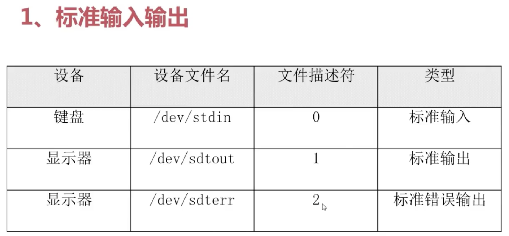
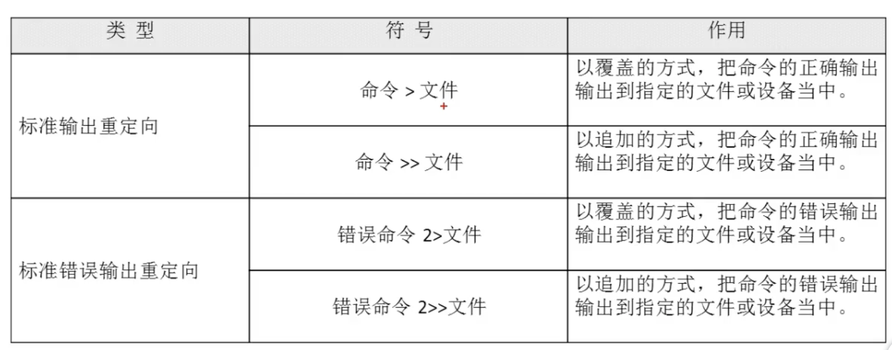
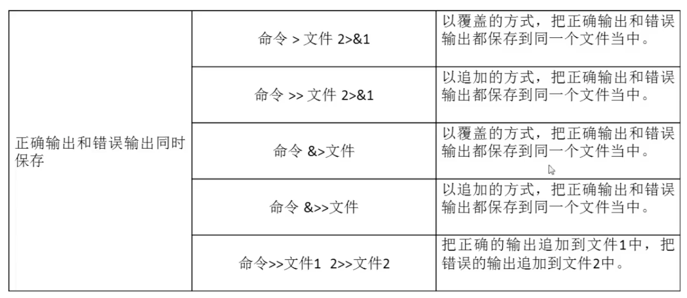
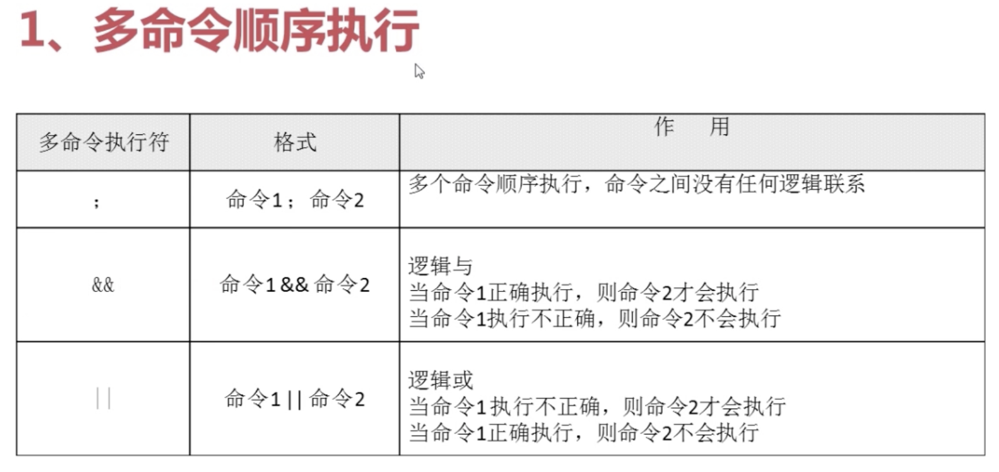
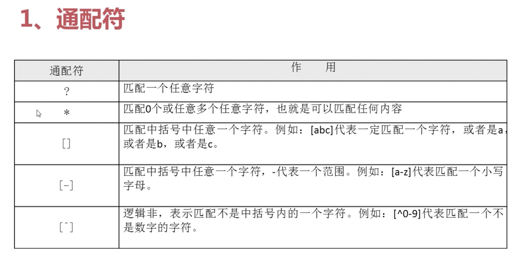
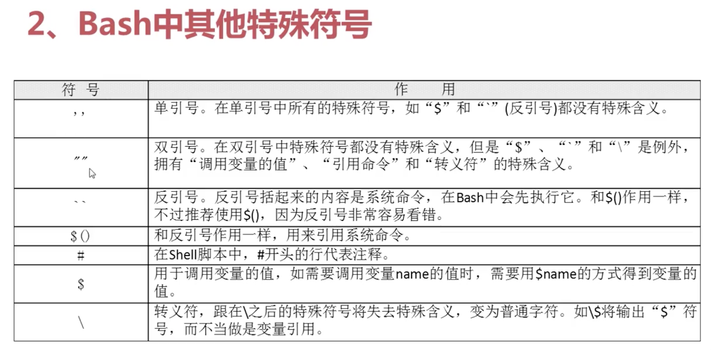

# Shell基础

## 目录
  - [Shell概述](#Shell概述)
  - [脚本执行方式](#脚本执行方式)
  - [Bash的基本功能](#Bash的基本功能)
    - [命令别名与快捷键](#命令别名与快捷键)
    - [历史命令](#历史命令)
    - [输出重定向](#输出重定向)

## Shell概述
Shell是一个命令行解释器，它为用户提供了一个向Linux内核发送请求以便运行程序的界面系统级程序，用户可以用Shell来启动、挂起、停止甚至是编写一些程序。

Shell还是一个功能相当强大的编程语言，易编写，易调试，灵活性较强。Shell是解释执行的脚本语言，在Shell中可以直接用Linux系统命令。
## 脚本执行方式
```
// 特别说明，#在Linux中代表注释
#!/bin/bash
```
**[⬆ 返回顶部](#Shell基础)**
## Bash的基本功能
### 命令别名与快捷键历史命令
```
# 查看系统中所有的命令别名
alias

# 设定命令别名
alias 别名='原命令'

# 将别名写入环境变量配置文件，使别名永久生效
vi ~/.bashrc

# 删除别名
unalias 别名
```
**命令生效顺序：**

1. 第一顺位执行用绝对路径或相对路径执行的命令。
2. 第二顺位执行别名。
3. 第三顺位执行Bash的内部命令。
4. 第四顺位执行按照$PATH环境变量定义的目录查找顺序找到的第一个命令。

**常用快捷键**

* Ctrl + c 强制终止当前命令
* Ctrl + l 清屏
* Ctrl + a 光标移动到命令行首
* Ctrl + u 从光标所在位置删除到行首
* Ctrl + e 光标移动到命令行首
* Ctrl + z 把命令放入后台
* Ctrl + r 在历史命令中搜索
### 历史命令
```
# 显示当前目录下的所有文件
ls -a
```
```js
history [选项] [历史命令保存文件]
```
**选项：**

* -c: 清空历史命令
* -w: 把缓存中的历史命令写入历史命令保存文件`~/.bash_history`

>需要注意的是：历史命名文件`bash_history`中保存的与终端上`history`列出的并不完全相同。

- `history`列出的不仅有文件中的，还有本次登录后执行的命令。需要正确注销后才会写入文件；
- `bash_history`文件中保存的只有上一次正确注销后的命令

#### 历史命令(环境变量)配置文件/etc/profile
- 默认保存1k条，可以在环境变量配置文件/etc/profile中修改 HISTSIZE=xxx
- 默认保存文件修改 HISTFILE=/path/FILENAME
- 剔除连续重复的条目 HISTCONTROL=ignoredups
- 忽略指定命令HISTIGNORE="pwd:ls:cd:"
- 格式化输出HISTTIMEFORMAT="%F %T"，bt只能输出设置生效之后的

#### `Ctrl+R`检索历史命令
直接键入想要查询的命令，进行动态模糊查询：直接回车可以执行。

#### 历史命令的调用
* 使用上下箭头调用以前的历史命令(常用)
* 使用 "!n" 重复执行第n条历史命令
* 使用 "!!"或者"!-1" 重复执行上一条命令
* 使用 "!字符串" 重复执行最后一条以该字符串开头的命令(常用)

**命令与文件补全：**在Bash中，命令与文件补全是非常方便与常用的功能，我们只要在输入命令或文件时，按'Tab'键就会自动进行补全。

**[⬆ 返回顶部](#Shell基础)**
### 输出重定向



```
# 输出到屏幕上
ifconfig

# 以覆盖的方式，把命令的正确输出输出到test.log文件中
ifconfig > test.log

# 以追加的方式，把命令的正确输出输出到test.log文件中，不覆盖原文件
ifconfig >> test.log

# 以覆盖的方式，把命令的错误输出输出到test.log文件中(2后面和test.log前面都不能有空格)
ifconfig 2>test.log

# 以追加的方式，把命令的错误输出输出到test.log文件中，不覆盖原文件
ifconfig 2>>test.log
```
标准输出重定向，前提是已知命令是否正确，用作记录命令和脚本执行的日志。

**特别注意：** 标准输出重定向的`>`与文件之间有空格，标准错误输出重定向的`>`与文件之间没有空格


```
# 以覆盖的方式，把命令的正确输出和错误输出都保存到test.log文件中
ifconfig > test.log>&1

# 以追加的方式，把命令的正确输出和错误输出都保存到test.log文件中
ifconfig >> test.log>&1
```
```
# 查看xdy文件，文件不存在，错误信息输出到test.log文件中
cat xdy.log >> test.log 2>&1 等同于 cat xdy.log &>> test.log

# 把正确的输出追加到test.log中，错误输出追加到err.log中
cat xdy.log >> test.log 2>>err.log（2后面不能加空格）
```
**输入重定向:**

```
# wc [选项] [文件名]
# 选项：
-c 只统计字节数
-w 只统计单词数
-l 只统计行数
```

### 多命令顺序执行(管道符)


```
# 命令格式
# 命令1的正确输出作为命令2的操作对象
命令1 | 命令2
```
### Shell中特殊符号(通配符)



**[⬆ 返回顶部](#Shell基础)**

## 参考文档
1. [Linux中history配置及使用技巧](https://blog.csdn.net/GX_1_11_real/article/details/80364246)