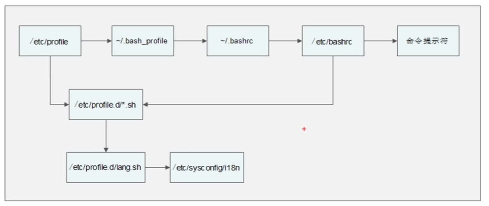
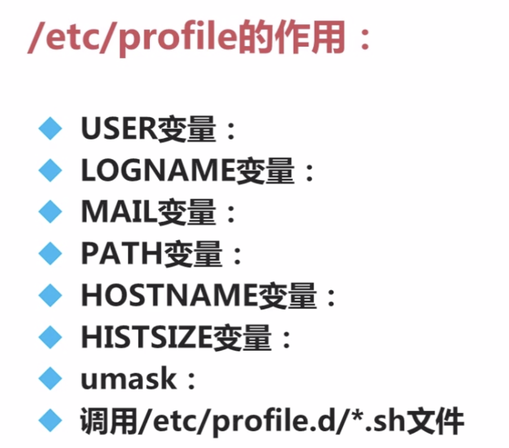
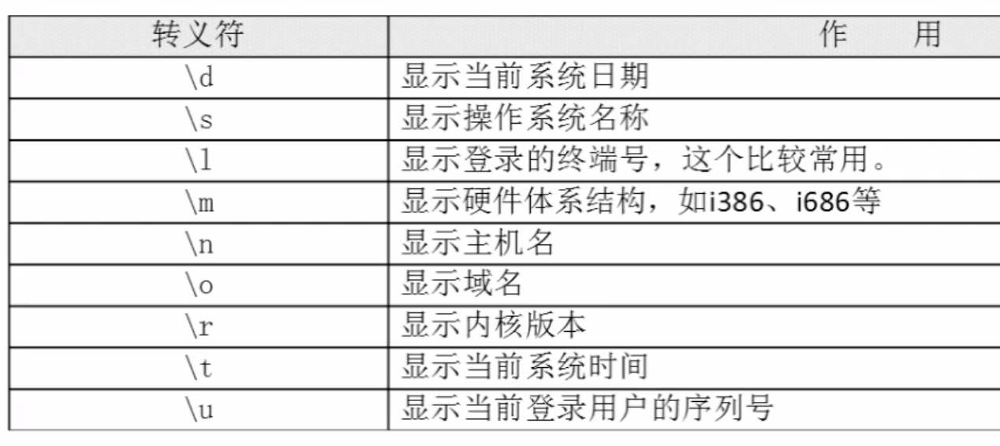

# shell编程之环境变量配置文件

## 目录
  - [环境变量配置文件](#环境变量配置文件)
    - [source命令](#source命令)
    - [环境变量配置文件简介](#环境变量配置文件简介)
    - [umask命令](#umask命令)
  - [环境变量配置文件的功能](#环境变量配置文件的功能)
  - [Shell登录信息](#Shell登录信息)
  - [问题汇总](#问题汇总)

## 环境变量配置文件
变量类型：

* 用户自定义变量(本地变量)
* 环境变量
* 预定义变量
* 位置参数变量

>环境变量作用：定义每个用户的操作环境。环境变量举例：path、ps1

### source命令
修改配置文件后，必须注销重新登录才能生效。但是使用`source`命令可以不用重新登录。
```js
source 配置文件
// 或者
. 配置文件
```
>特别注意：在linux中，所有以点(.)开头的文件都是隐藏文件。

**[⬆ 返回顶部](#shell编程之环境变量配置文件)**
### 环境变量配置文件简介
环境变量配置文件中主要是定义对系统操作环境生效的系统默认环境变量，如PATH等。

常见环境变量配置文件：

* /etc/profile：是全局的profile文件，设置后会影响到所有用户；
* /etc/profile.d/*.sh：全局的
* ~/.bash_profile：用户级别的，每个用户在自己的用户目录下都有自己的`.bash_profile`文件；
* ~/.bashrc：用户级别的，每个用户在自己的用户目录下都有自己的`.bashrc`文件；
* /etc/bashrc：为每一个运行`bash shell`的用户执行此文件，当`bash shell`被打开时，该文件被读取；

>特别注意：`.bash_profile`是隐藏文件，在Linux中所有以`.`开头文件都是隐藏文件，需要使用`ls -a`命令才能看到。放在`/etc`目录下的环境变量配置文件对所有用户有效；放在`~/`目录下的环境变量配置文件只对当前用户有效。



>正常输入用户名密码的登录过程配置文件加载顺序：

- /etc/profile -> /etc/profile.d/*.sh -> /etc/profile.d/lang.sh -> /etc/sysconfig/i18n
- ~/.bash_profile -> ~/.bashrc -> /etc/bashrc -> 命令提示符

>从超级用户切换到其他用户时配置文件加载顺序：(只是用户切换，没有登录)

- /etc/bashrc -> /etc/profile.d/*.sh -> /etc/profile.d/lang.sh -> /etc/sysconfig/i18n -> 命令提示符

### /etc/profile环境变量配置文件的作用


>修改历史命令条数：HISTSIZE
### ~/.bash_profile环境变量配置文件的作用
- 调用`~/.bashrc`文件
- 在PATH变量后面加入了":$HOME/bin"这个目录

### .bashrc环境变量配置文件的作用
- 定义命令别名alias
- 调用`/etc/bashrc`文件

>`.bashrc`文件类似于`/etc/bashrc`，不需要重启生效，重新打开一个bash即可生效。`/etc/bashrc`对所有用户新打开的bash都生效，但`~/.bashrc`只对当前用户新打开的bash生效。

>`.zshrc`也有相同作用，用来定义命令别名。
### /etc/bashrc环境变量配置文件的作用
- PS1(修改登录提示符)变量
- umask
- PATH变量
- 调用/etc/profile.d/*.sh文件

>如果我们想对所有用户修改某个配置，并在修改以后新打开的bash时都生效。可以通过修改这个文件来实现，修改这个文件不用重启，**重新打开一个bash即可生效**。
### .bash_history
保存历史命令。
### /etc/sysconfig/i18n
定义系统默认语言。

**[⬆ 返回顶部](#shell编程之环境变量配置文件)**
### umask命令
umask命令可以用来查看系统默认权限。
```js
➜  ~ umask
// 022就是系统默认权限
022
```
当我们新建一个文件时，默认权限就是`022`。

1. 默认新建的文件最高权限为666(即只有读写权限，没有执行权限，如果需要执行权限，需要自己手动添加)
2. 目录最高权限为777(对于目录而言，执行权限即可以cd到该目录)
3. 权限不能使用数字进行换算，而必须使用字母
4. umask定义的权限，是系统默认权限中准备丢弃的权限

```js
// 新建一个文件和目录，并查看对应的文件和目录权限
touch demo.js
mkdir demo
```
```js
drwxr-xr-x    2 liujie26  672505530    68B  4 21 20:21 demo
-rw-r--r--    1 liujie26  672505530     0B  4 21 20:20 demo.js
```
```js
// 新建一个脚本文件
➜  ~ touch demo.sh
// 权限是644
➜  ~ ll demo.sh
-rw-r--r--  1 liujie26  672505530     0B  4 21 20:28 demo.sh

// 没有执行权限
➜  ~ ./demo.sh
zsh: permission denied: ./demo.sh
// 增加执行权限
➜  ~ chmod 777 demo.sh
➜  ~ ll demo.sh
-rwxrwxrwx  1 liujie26  672505530    80B  4 21 20:30 demo.sh
// 可以正常执行
➜  ~ ./demo.sh
1
2
^C
```
```
# r=4 w=2 x=1
文件最高权限为666，默认权限为022
666换算成字母为：rw-rw-rw-
022换算成字母为：----w--w-
// 这里是将最高权限字母中的默认权限包含的字母改为-
// 即将rw-rw-rw-中后两组中的rw-改为r--
666 - 022 = 644换算为字母为：rw-r--r--

目录最高权限为777，默认权限为022
777换算成字母为：rwxrwxrwx
022换算成字母为：----w--w-
777 - 022 = 755换算为字母为：rwxr-xr-x
```
**[⬆ 返回顶部](#shell编程之环境变量配置文件)**
## 环境变量配置文件的功能
### 其他配置文件
#### 注销时生效的环境变量配置文件
```js
// 可以用来退出登录时清除历史命令
~/.bash_logout
```
#### .bash_history(保存历史命令)
```js
// 历史命令记录保存在硬盘的~/.bash_history文件中
~/.bash_history
```
>需要注意：当前登录后的命令先保存在内存中，正确退出后才写入文件。
## Shell登录信息
### 本地终端欢迎信息：/etc/issue

### 远程终端登录提示信息环境变量配置文件(/etc/issue.net)
- 不支持转义符，即转义符在`/etc/issue.net`文件中不能使用；
- 是否显示此欢迎信息，由ssh的配置文件`/etc/ssh/sshd_config`决定，加入`"Banner /etc/issue.net"`行才能显示，记得重启SSH服务->`service sshd restart`。

### 登录后欢迎信息：/etc/motd
不管是本地登录，还是远程登录，都可以显示此欢迎信息。

**[⬆ 返回顶部](#shell编程之环境变量配置文件)**
## 问题汇总
### Mac每次都要执行`source ~/.bash_profile`配置的环境变量才生效
当我们在`~/.bash_profile`中配置环境变量后，每次重启终端后配置的不生效。需要重新执行:
```js
$source ~/.bash_profile
```
发现zsh加载的是`~/.zshrc`文件，而`.zshrc`文件中并没有定义任务环境变量。

>解决办法：在`~/.zshrc`文件最后增加一行：
```js
source ~/.bash_profile
```

**[⬆ 返回顶部](#shell编程之环境变量配置文件)**
## 参考文档
1. [shell编程之环境变量配置文件](https://www.imooc.com/learn/361)
2. [~/.profile ~/.bashrc和~./bash_profile的理解以及zsh的使用](https://www.jianshu.com/p/b39fd35e2360)
3. [强大的zsh配置文件](http://www.cnblogs.com/ma6174/archive/2012/05/08/2490921.html)
4. [Linux中profile、bashrc、bash_profile之间的区别和联系](https://blog.csdn.net/chenchong08/article/details/7833242)
5. [Linux| 用户目录下三个bash文件的作用(.bash_history,.bash_logout,.bash_profile,.bashrc)](https://blog.csdn.net/u011479200/article/details/86501366)
6. [MAC 设置环境变量path的几种方法](https://www.cnblogs.com/shineqiujuan/p/4693404.html)
7. [nodejs 中的 NODE_PATH](https://segmentfault.com/a/1190000002478924)