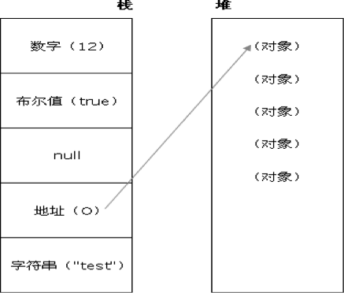

[TOC]
### 1. JS的基本规范

1. 不要在同一行声明多个变量
2. 请使用 ===/!==来比较true/false或者数值
3. 使用对象字面量替代new  Array()这种形式
4. 不要使用全局函数
5. Switch语句必须带有default分支
6. 函数不应该有时候有返回值，有时候没有返回值
7. For循环必须使用大括号
8. If语句必须使用大括号
9. for-in循环中的变量应该使用var关键字明确限定作用域，从而避免作用域污染

### 2. JS严格模式
**特别注意：ES6的模块自动采用严格模式。**

严格模式主要有以下限制：

1. 变量必须声明后再使用
2. 函数的参数不能有同名属性，否则报错
3. 不能使用with语句
4. 不能对只读属性赋值，否则报错
5. 不能使用前缀0表示八进制数，否则报错
6. 不能删除不可删除的属性，否则报错
7. 不能删除变量delete prop，会报错，只能删除属性delete global[prop]
8. eval不会在它的外层作用域引入变量
9. eval和arguments不能被重新赋值
10. arguments不会自动反映函数参数的变化
11. 不能使用arguments.callee
12. 不能使用arguments.caller
13. 禁止this指向全局对象
14. 不能使用fn.caller和fn.arguments获取函数调用的堆栈
15. 增加了保留字（比如protected、static和interface）

**设立"严格模式"的目的，主要有以下几个：**

1. 消除Javascript语法的一些不合理、不严谨之处，减少一些怪异行为;
2. 消除代码运行的一些不安全之处，保证代码运行的安全；
3. 提高编译器效率，增加运行速度；
4. 为未来新版本的Javascript做好铺垫。

注：经过测试IE6,7,8,9均不支持严格模式。

### 3. JS数据类型(画出内存图)
* 栈：基本数据类型（Undefined，Null，Boolean，Number、String）
* 堆：引用数据类型（对象、数组和函数）



**两种类型的区别是：存储位置不同；**

**基本数据类型**是直接存储在栈(stack)中的简单数据段，占据空间小、大小固定，属于被频繁使用数据，所以放入栈中存储；

**引用数据类型**存储在堆(heap)中的对象，占据空间大、大小不固定。如果存储在栈中，将会影响程序运行的性能；引用数据类型在栈中存储了指针，该指针指向堆中该实体的起始地址。当解释器寻找引用值时，会首先检索其在栈中的地址，取得地址后从堆中获得实体。

### 4. 如何判断变量是否为数组？
在ES5中，我们至少有如下5种方式去判断一个值是否数组：
```js
var a = [];
// 1.基于instanceof
a instanceof Array;
// 2.基于constructor
a.constructor === Array;
// 3.基于Object.prototype.isPrototypeOf
Array.prototype.isPrototypeOf(a);
// 4.基于getPrototypeOf
Object.getPrototypeOf(a) === Array.prototype;
// 5.基于Object.prototype.toString
Object.prototype.toString.apply(a) === '[object Array]';
```
在ES6中判断变量是否为数组
鉴于数组的常用性，在ES6中新增了Array.isArray方法，使用此方法判断变量是否为数组，则非常简单，如下：

```js
Array.isArray([]); // => true
Array.isArray({0: 'a', length: 1}); // => false
```
```js
// polyfill
// 假如不存在 Array.isArray()，则在其他代码之前运行下面的代码将创建该方法
if (!Array.isArray) {
    Array.isArray = function(arg) {
        return Object.prototype.toString.call(arg) === '[object Array]';
    };
}
```

[更多关于Array.isArray详见](https://developer.mozilla.org/zh-CN/docs/Web/JavaScript/Reference/Global_Objects/Array/isArray)

### 5. 数组遍历的方法
1. 最原始的写法就是for循环
2. 数组内置的forEach方法（这种写法的问题：无法中途跳出forEach循环，break命令或return命令都不能奏效）。
3. for…in循环(遍历对象)
4. ES6中的for…of循环


### 6. null和undefined的区别
* Null == undefined会返回true,是因为它们是类似的值，更准确的说undefined派生自null。
* Null === undefined会返回false，是因为它们是不同类型的值。
* null表示空对象，**转为数值时为0**；undefined是一个表示未定义，**转为数值时为NaN**。
* 当声明的变量还未被初始化时，变量的默认值为undefined。
* null用来表示尚未存在的对象，常用来表示函数企图返回一个不存在的对象。

#### 6.1 undefined的用法
undefined表示缺少值，就是此处应该有一个值，但是还没有定义。典型用法:

1. 变量被声明了，但没有赋值时，就等于undefined。
2. 调用函数时，应该提供的参数没有提供，该参数等于undefined。
3. 对象没有赋值的属性，该属性的值为undefined。
4. 函数没有返回值时，默认返回undefined。

#### 6.2 null的用法
null表示"没有对象"，即该处不应该有值。典型用法是：

1. 作为函数的参数，表示该函数的参数不是对象。
2. 作为对象原型链的终点。

### 7. JS操作符


### 优秀文章
1. [99%的人都理解错了HTTP中GET与POST的区别](https://mp.weixin.qq.com/s?__biz=MzI3NzIzMzg3Mw==&amp;mid=100000054&amp;idx=1&amp;sn=71f6c214f3833d9ca20b9f7dcd9d33e4#rd)
2. [从一道面试题谈谈函数柯里化(Currying)](http://cnodejs.org/topic/5884574e250bf4e2390e9e99)