>正则表达式工具：http://regexper.com

>正则表达式(Regular Expression)：使用单个字符串来描述、匹配一系列符合某个句法规则的字符串。简而言之，就是按照某种规则去匹配符合条件的字符串。

```js
// 查看文件目录
ls
// 在当前目录中查找所有的txt文件
find ./ -name *.txt
```

* `.`：代表任意字符，可以是中文英文数字或特殊符号
* `*`：代表0到多个或任意个字符
* `+`：表示1个或多个
* `?`：表示0个或1个
* `^`：表示开头
* `$`：表示结尾
* `\b`：匹配单词边界
* `\`：转义字符
* `()`：分组，$1-9按顺序引用分组($1：提取分组内容，即第一个括号里的内容)
* `\d`：数字
* `{}`：个数
* `[]`：或
>匹配日期格式正则：
```js
^(\d{4})[/-](\d{2})[/-](\d{2})$ // 2019-01-01或2019/01/10
```
>表示以四位数字开头的年份 /或者- 2位数的月份 /或者- 2位数的日期结尾 的格式。

>需要注意：非英文字符，需要进行转义。分组，对需要的数据外加 () 进行分组，然后使用 $1 $2  $3 进行获取替换。

#### Regexp对象
JavaScript通过内置对象RegExp支持正则表达式。有两种方法实例化RegExp对象：

* 字面量
* 构造函数
>字面量形式：
```js
// \b表示单词边界
// 匹配单词is
// g表示全局匹配
var reg = /\bis\b/g;
```
>构造函数形式：
```js
var reg = new RegExp('\\bis\\b', 'g');
```
>修饰符：

* g：global全文搜索，不添加，搜索到第一个匹配停止；
* i：ignore case 忽略大小写，默认大小写敏感；
* m：multiple lines多行搜索

#### 元字符
正则表达式由两种基本字符类型组成：

* 原义文本字符
* 元字符：指在正则表达式中有特殊含义的非字母字符。例如`\b`指的是单词边界。

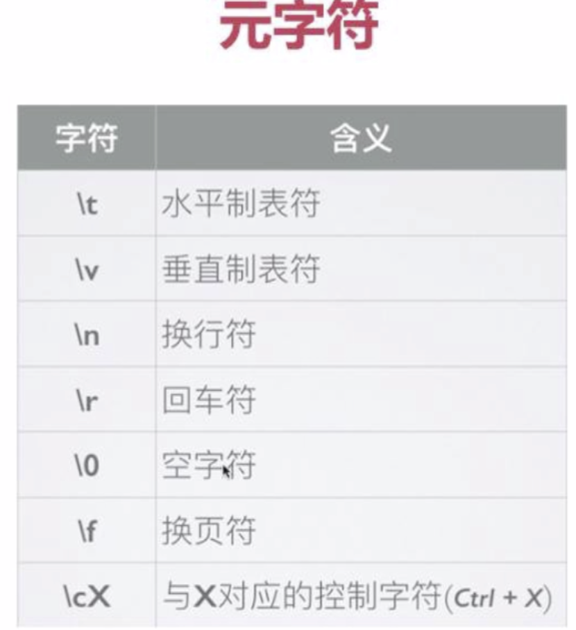

>匹配字符类：


```js
// 替换abc字符
'a1b2c3'.replace(/[abc]/g, 'X'); // X1X2X3
```

```js
// 替换非abc的字符
'a1b2c3'.replace(/[^abc]/g, 'X'); // aXbXcX
```
#### 范围类
>使用`[a-zA-Z]`来表示从a到z和从A到Z的任意字符。需要注意的是在范围类中的`-`是不起作用的，如需匹配需要在范围类后面加上`-`。

```js
'2019-01-20'.replace(/[0-9-]/g, 'X'); // XXXXXXXXXX
```
#### 预定义类及边界
正则表达式提供了**预定义类**来匹配常见的字符类。
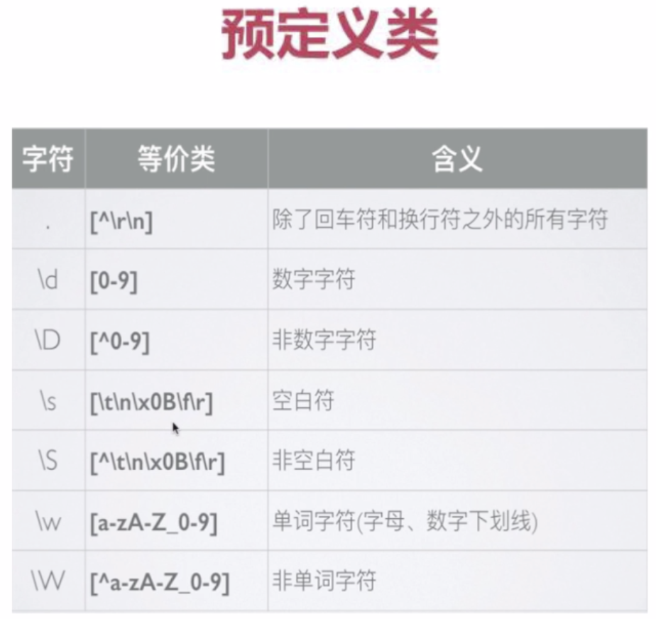
>需要注意：匹配任意字符，即除了回车和换行符。`[^\r\n]`


>边界匹配：

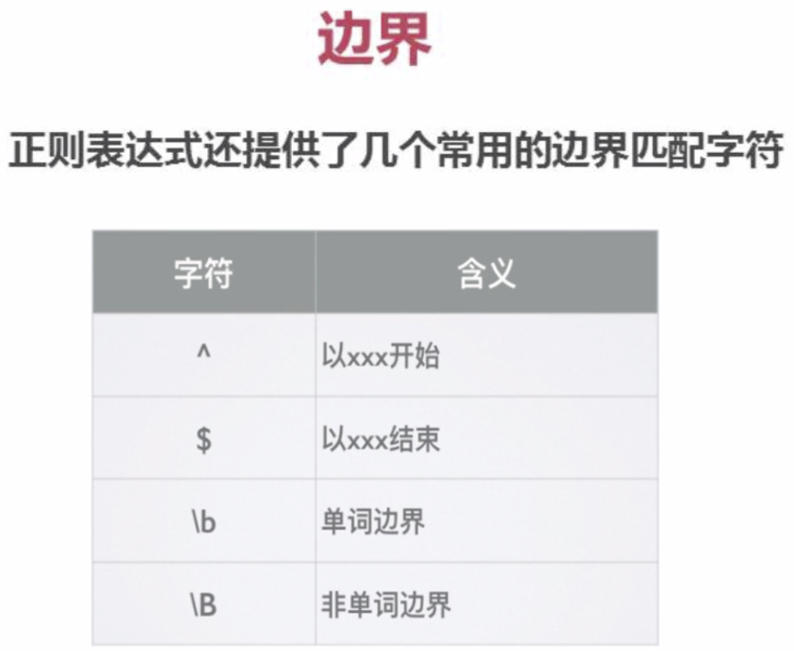
>注意边界和边界取反：


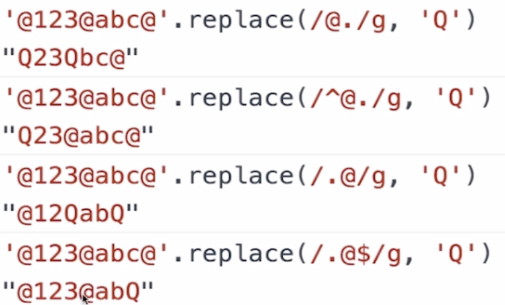
>处理多行的情况：

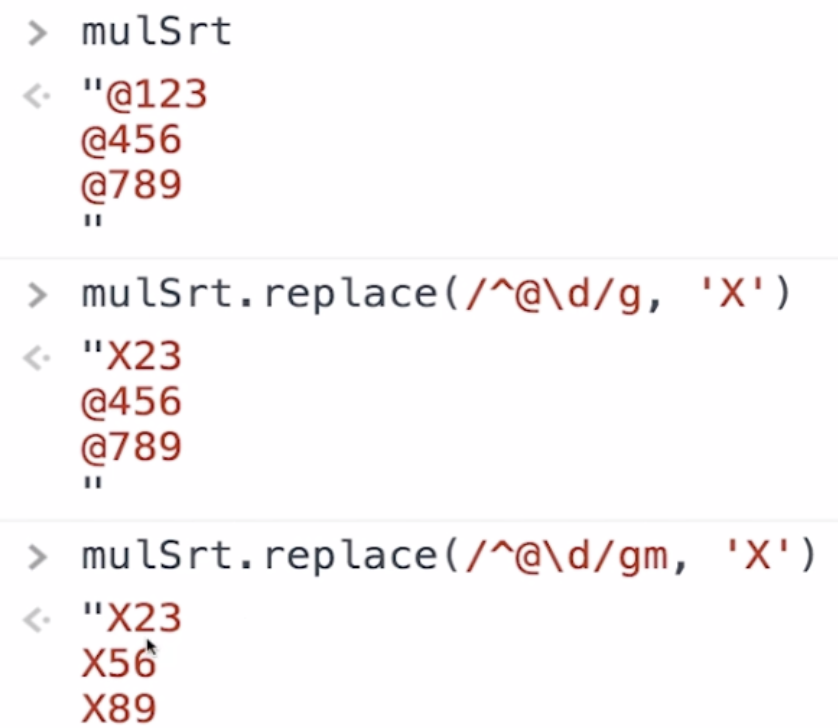
#### 量词
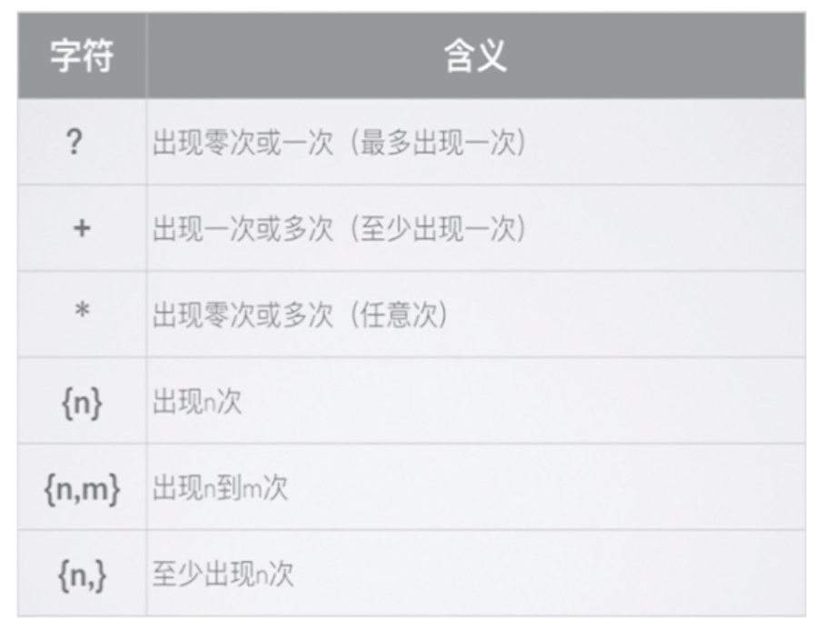
#### 贪婪模式与非贪婪模式
>贪婪模式：尽可能多的匹配。
```js
// 该正则/\d{3,6}/g的意思是匹配3到6个数字
// 正则默认是贪婪匹配，即尽可能多的匹配，所以这里匹配了6个数字
'12345678'.replace(/\d{3,6}/g, 'Q'); // Q78
```
>非贪婪模式：在后面加？
```js
// 这里123和456均被匹配，被替换成了Q
'12345678'.replace(/\d{3,6}?/g, 'Q'); // QQ78
```

#### 分组
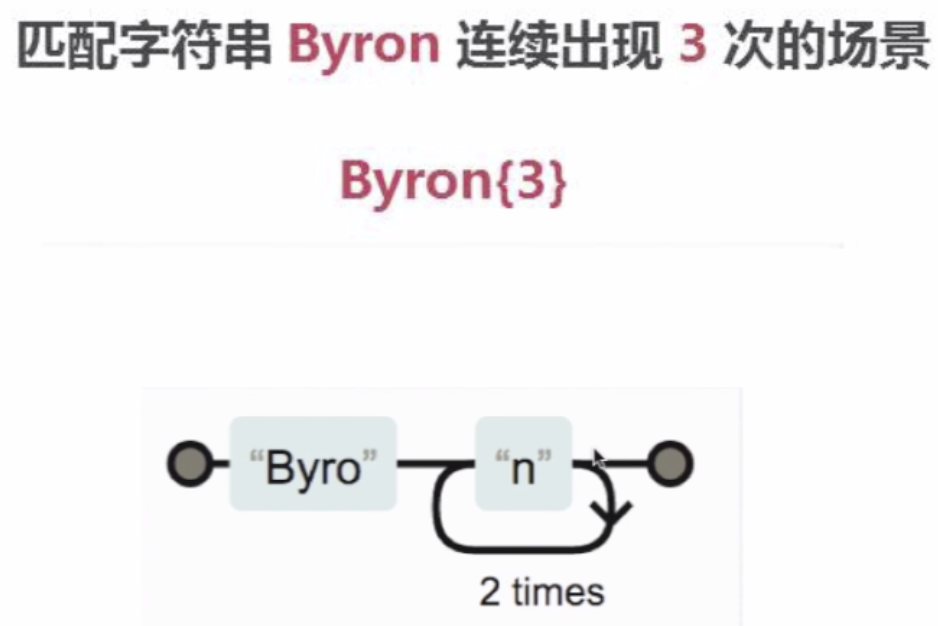
>上面的是n重复3次，而不是整个单词重复3次。

>使用`()`可以达到分组的功能，使量词作用于分组。

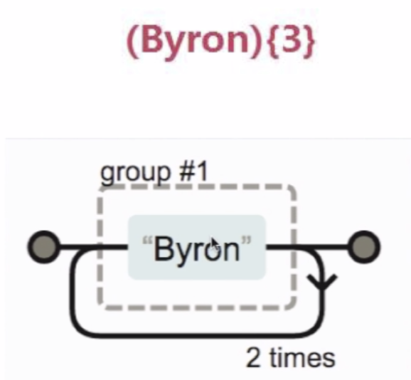
```js
'a1b2c3d4'.replace(/([a-z]\d){3}/g, 'A'); // Ad4
```
##### 或
>使用`|`可以达到或的效果。

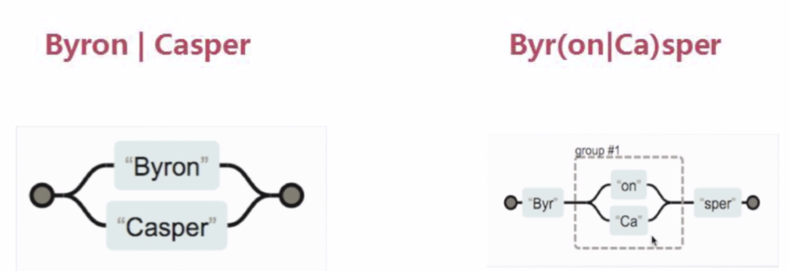
>后面的或作用于：`on和Ca`。
```js
'ByronCasper'.replace(/Byron|Casper/g, 'Q'); // QQ
```
```js
'ByronsperByrCasper'.replace(/Byr(on|Ca)sper/g, 'Q'); // QQ
```

##### 反向引用

```js
'2019-01-20'.replace(/(\d{4})-(\d{2})-(\d{2})/g, '$2/$3/$1'); // 01/20/2019

// 匹配第一个分组
'2019-01-20'.replace(/(\d{4})-(\d{2})-(\d{2})/g, '$1'); // 2019
// 第二个分组
'2019-01-20'.replace(/(\d{4})-(\d{2})-(\d{2})/g, '$2'); // 01
// 第三个分组
'2019-01-20'.replace(/(\d{4})-(\d{2})-(\d{2})/g, '$3'); // 20
```
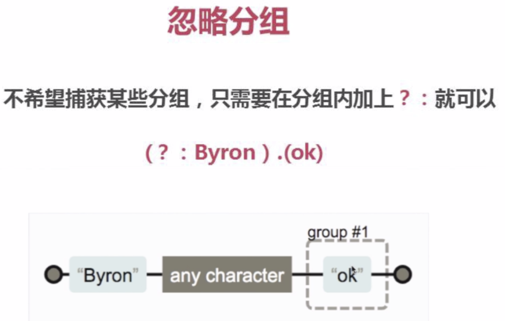
#### 前瞻
正则表达式从文本头部向尾部开始解析，文本尾部方向，称为"前"。
前瞻就是在正则表达式匹配到规则的时候，向前检查是否符合断言，后顾/后瞻方向相反。
>需要注意：js不支持后顾。

符合和不符合特定断言称为**肯定/正向**匹配和**否定/负向**匹配。
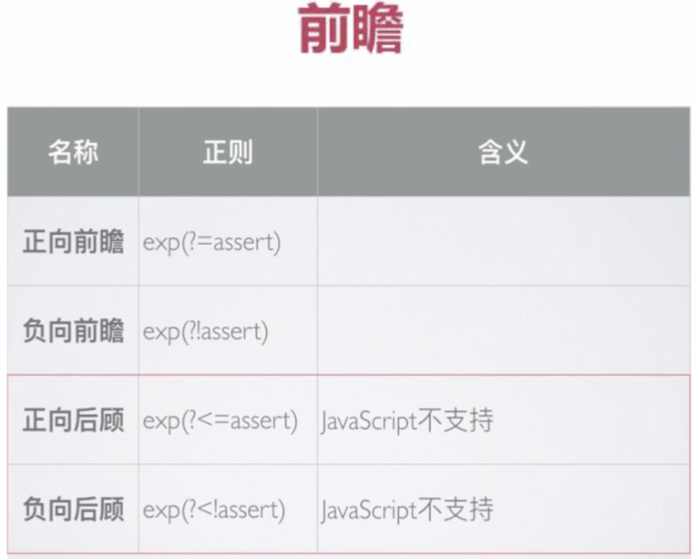
```js
// 只匹配\w，后面的是断言部分
'a2*3'.replace(/\w(?=\d)/g, 'X'); // X2*3

'a2*34v8'.replace(/\w(?=\d)/g, 'X'); // X2*X4X8
```
#### js对象属性
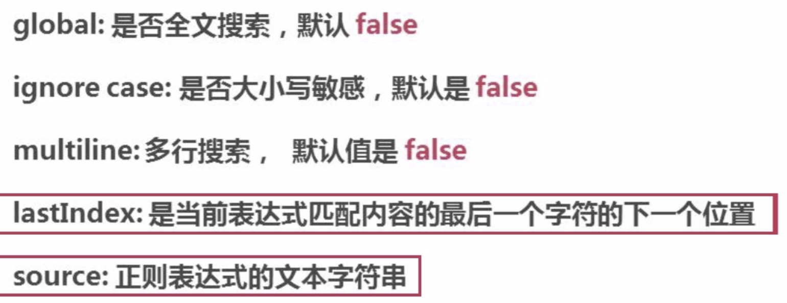
```js
var reg = /\w(?=\d)/g;
reg.source; // \w(?=\d)
```
#### test方法和exec方法
>`RegExp.prototype.test(str)`：用于测试字符串参数中是否存在匹配正则表达式模式的字符串，存在返回true，否则返回false。

```js
var reg2 = /\w/g;
```
>进行`reg2.test('ab')`时，第三次会变成`false`。

>原因：
```js
while(reg2.test('ab')) {
    console.log(reg2.lastIndex);
}
```
即进行`test`时，正则表达式的`lastIndex`会发生变化，输出：1和2，表示第一个匹配上了、第二个匹配上了。

>`RegExp.prototype.exec(str)`：使用正则表达式模式对字符串执行搜索，并将更新全局`RegExp`对象的属性以反映匹配结果。

如果没有匹配则返回`null`，否则返回一个结果数组：

* `index`声明匹配文本的第一个字符的位置；
* `input`存放被检索的字符串string。

>非全局调用：

* 调用非全局的RegExp对象的exee()时，返回数组；
* 第一个元素是与正则表达式相匹配的文本；
* 第二个元素是与RegExpObject的第一个子表达式（分组）相匹配的文本；
* 第三个元素是与RegExp对象的第二个子表达式（分组）相匹配的文本。

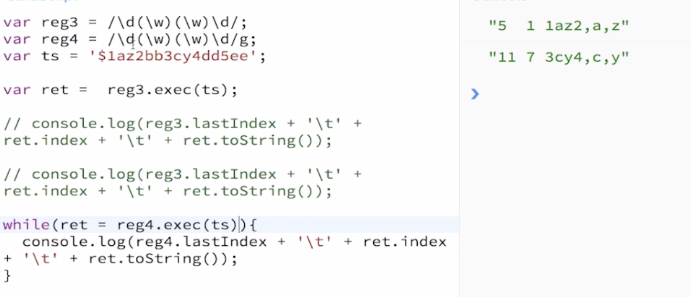
#### 字符串对象方法
>`string.protatype.search(reg)`

`search()`方法用于检索字符串中指定的子字符串，或检索与正则表达式相匹配的子字符串。方法返回第一个匹配结果`index`，查找不到返回`-1`。

>需要注意：`search()`方法不执行全局匹配，它将忽略标志`g`，并且总是从字符串开始进行检索。

>`string.prototype.match(reg)`

`match()`方法将检索字符串，以找到一个或多个与`regexp`匹配的文本。`regexp`是否具有标志`g`对结果影响很大。

>非全局调用：如果`regexp`没有标志`g`，那么`match()`方法就只能在字符串中执行一次匹配，如果没有找到任何匹配的文本，将返回`null`，否则将返回一个数组，其中存放了与它找到的匹配文本有关的信息。**返回数组**的第一个元素存放的是匹配文本，而其余元素存放的是与正则表达式的子表达式匹配的文本。

除了常规数组元素之外，返回的数组还含有2个对象属性：

* `index`声明匹配文本的起始字符在字符串的位置；
* `input`声明对`stringobject`的引用。

>全局调用：如果`regexp`具有标志`g`，则`match()`方法将执行全局检索，找到字符串中的所有匹配子字符串。

* 没有找到任何匹配的子串，则返回null；
* 如果找到了一个或多个匹配子串，则返回一个数组，数组元素中存放的是字符串中所有的匹配子串，而且也没有index属性或input属性。

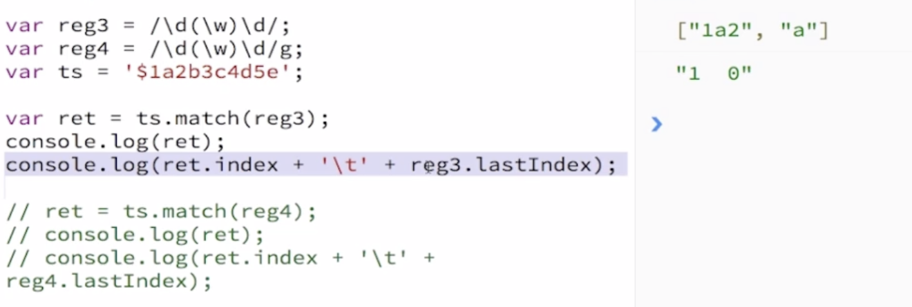
>全局匹配：


>String.prototype.split(reg)

* 经常使用`split`方法把字符串分割为字符数组；
```js
'a,b,c,d'.split(','); // ['a','b','c','d']
```

* 在一些复杂的分割情况下可以使用正则表达式解决：
```js
'a1b2c3d'.split(/\d/g); // ['a','b','c','d']
```

>String.prototype.replace(rex)：字符串中的某些子串替换为需要的内容。


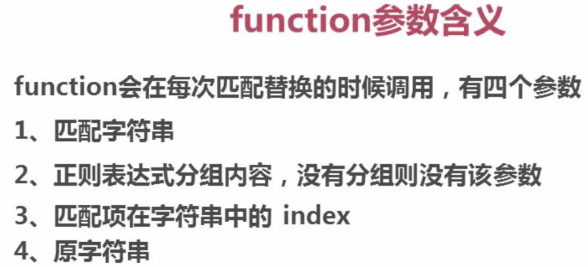
```js
'a2c'.replace('2', 6); // a6c
'a2c2d2'.replace('2', 6); // a6c2d2
'a2c2d2'.replace(/2/g, 6); // a6c6d6
```
```js
'a1b2c3d4'.replace(/\d/g, function(match, index, origin) {
    console.log(index);
    return parseInt(match) + 1;
});
```
>结果如下：
```js
1
3
5
7
"a2b3c4d5"
```
```js
'a1b2c3d4e5'.replace(/(\d)(\w)(\d)/g, function(match, group1, group12, group3, index, origin) {
    console.log(match);
    return group1 + group3;
});
```
>结果如下：
```js
1b2
3d4
"a12c34e5"
```
## 之前总结
>之前写的一篇总结：https://blog.csdn.net/liujie19901217/article/details/51219672